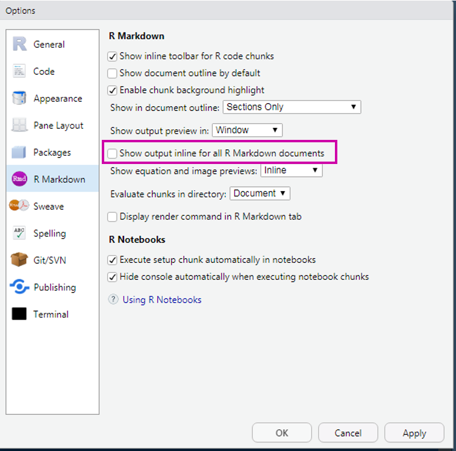
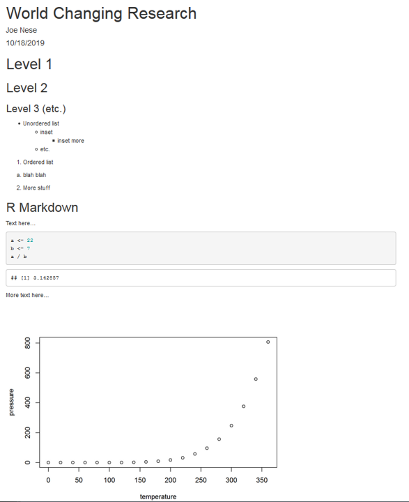

```{r setup, include=FALSE}
options(htmltools.dir.version = FALSE)

knitr::opts_chunk$set(echo = TRUE,
                      message = FALSE,
                      warning = FALSE)

library(xaringanthemer)
library(xaringanExtra)
library(tidyverse)
library(knitr)
library(here)
library(kableExtra)
library(gt)
library(palmerpenguins)
library(DT)
library(reactable)
library(gtsummary)

```

```{r xaringan-themer, include=FALSE, warning=FALSE}
style_duo_accent(
  primary_color = "#1F4E79",
  secondary_color = "#0072B2",
  header_font_google = xaringanthemer::google_font("Atkinson Hyperlegible", "600"),
  text_font_google   = xaringanthemer::google_font("Atkinson Hyperlegible", "300", "300i"),
  code_font_google   = xaringanthemer::google_font("IBM Plex Mono"),
  colors = c(
    darkblue = "#0072B2",
    lightblue = "#56B4E9",
    darkorange = "#D55E00",
    lightorange = "#E69f00",
    yellow = "#F0E442",
    green = "#009E73",
    pink = "#CC79A7",
    gray = "999999",
    white = "#FFFFFF"
  )
)

```

```{r xaringanExtra-freezeframe, echo=FALSE}
xaringanExtra::use_freezeframe()
```

class: inverse, left, middle

# R Markdown
## Week 5

---

# Agenda

* R Markdown basics
* YAML options
* Chunk Options
* Global Options
* Inline Code

**Learning Objectives**
* Understand how to render R Markdown documents and mix code with text
* Understand different chunk options
* Understand inline code evaluation

---
# What is R Markdown?

* An authoring framework for data science
* A document format (.Rmd)
* An `R` package named `{rmarkdown}`
* A file format for making dynamic documents with `R`
* A tool for integrating prose, code, and results
* A computational document
* Everything

.footnote[
Credit [Allison Hill](https://apreshill.github.io/rmd4cdc/#12)
]

---
background-image: url(https://raw.githubusercontent.com/allisonhorst/stats-illustrations/master/rstats-artwork/rmarkdown_rockstar.png)
background-size: contain

.footnote[
Credit [Allison Horst](https://github.com/allisonhorst/stats-illustrations)
]

---
background-image: url(https://raw.githubusercontent.com/allisonhorst/stats-illustrations/master/rstats-artwork/rmarkdown_wizards.png)
background-size: contain

.footnote[
Credit [Allison Horst](https://github.com/allisonhorst/stats-illustrations)
]

---
background-image: url(https://raw.githubusercontent.com/allisonhorst/stats-illustrations/master/rstats-artwork/reproducibility_court.png)
background-size: contain

.footnote[
Credit [Allison Horst](https://github.com/allisonhorst/stats-illustrations)
]

---
# Formats

* R Markdown will render to HTML and PDF really well 
* Word kinda-sorta supported
* You can also create websites, slides, books, etc.

---
# Distributions

You need a tex (pronounced tek) distribution 
* For this class, and probably everything you'll ever need: `{tinytex}`
<br>
`install.packages("tinytex")`
<br>
`tinytex::install_tinytex() `

**Full Distributions**
* Macs
  + MacTex: http://www.tug.org/mactex/
* PC
  + MikTex: https://miktex.org/download

---
# R Markdown

From within a RStudio Project, open a new R Markdown file

.pull-left[
```{r, echo=FALSE, out.width='50%'}

```
]

--

.pull-right[
```{r, echo=FALSE, out.width='100%'}

```
]

---

# Let's render!

```{r, echo=FALSE, out.width='100%'}

```

---
### R Markdown input inline or in Viewer

```{r, echo=FALSE, out.width='100%'}

```

---
# YAML Front Matter

```{r, eval=FALSE}
---
title: "World Changing Research"
author: "Joe Nese"
date: "2021-11-3"
---
```

* Yet Another Markup Language?
* Three dashes `---` before and after the YAML fields
  + Start with the default YAML
* Case sensitive
* Format sensitive (spaces & tab) - _very sensitive_
* *Many* other fields are possible
  + For example, you may want to include an argument for `output:` `pdf_document`, `html_document`, `word_document`
  + Must be specified as it is rendered, if not supplied

---
## Syntax Highlighting

* The YAML will control a lot of how a document looks 
* For example, if you wanted to render with a different [syntax highlighter](https://bookdown.org/yihui/rmarkdown/html-document.html)


.pull-left[
standard Rmd
```{r, eval=FALSE, echo=TRUE}
---
title: "Doc Title"
output: pdf_document
---
```
<br>

```{r, echo=FALSE}
knitr::include_graphics("images/rmd_10.png")
```
]

--

.pull-right[
`kate`
```{r, eval=FALSE, echo=TRUE}
---
title: "Doc Title"
output: 
  pdf_document:
    highlight: kate
---
```

```{r, echo=FALSE}
knitr::include_graphics("images/rmd_11.png")
```
]

---
# Headers

\# Level 1
<br>
\#\# Level 2
<br>
\#\#\# Level 3

* Great for organizing text **and** code

---
## Table of Contents

* Specify a table of contents in the YAML
* A table of contents will be automatically generated for you based on your **headers**

\# Header 1
<br>
\#\# Header 2

```{r, eval=FALSE}
---
output: 
  html_document:
    toc: true #<<
---
```

---
## Table of Contents - change depth

* By default, the TOC will only go down to 3 levels
* Change that with `toc_depth:`

```{r, eval=FALSE}
---
output: 
  html_document:
    toc: true
    toc_depth: 5 #<<
---
```

---
## Table of Contents - float it

* For **HTML documents**, allow the TOC to float along the side as you scroll

```{r, eval=FALSE}
---
output: 
  html_document:
    toc: true
    toc_depth: 5
    toc_float: true #<<
---
```

---
## Code Folding

* Provide a button for people to be able to see the code, but otherwise have it hidden

```{r, eval=FALSE}
---
output: 
  html_document:
    toc: true
    toc_depth: 5
    toc_float: true
    code_folding: hide #<<
---
```

.darkorange[[Bean Experiment .Rmd]]

---
# Code Chunks vs. Text

```{r, echo=FALSE, out.height='50%'}

```

---
# Code Chunks

Start a code chunk with ````{r} `

Then produce some `R` code

then close the chunk with three additional back ticks ```` `

<b> OR </b>

<b>Dropdown</b>: *Code* ⬇️ *Insert Chunk*

<b>Shortcut</b>: `Ctrl/Command + Alt + I`

````
```{r cars}`r ''`
a <- 22
b <- 7

a / b
```
````

---
# Chunk Names

* Use single word: `chunk1`
* Or use hyphen (`-`) to separate words: `chunk-1` 
* Do **not** use spaces: ~~`chunk 1`~~
* Do **not** use underscore ~~`chunk_1`~~
* Chunk names can only be used **once**

--

Think kebabs, not snakes
* `bar-plot-1`
* `bar-plot-2`
* `hist-plot-1`
* `model-1`

.footnote[
[Allison Hill](https://apreshill.github.io/rmd4cdc/#100)
]

---
# Headings and Lists<sup>^</sup>

.pull-left[
```{r, echo=FALSE, out.width='70%'}

```
]

.pull-left[
```{r, echo=FALSE, out.width='60%'}

```
]

.footnote[
<sup>^</sup> not an `R` vector list
]

---
.pull-left[
```{r, echo=FALSE, out.width='100%'}

```
]

.pull-left[
```{r, echo=FALSE, out.width='100%'}

```
]

---
# More Advanced Options

* chunk options
* setting global options
* inline code evaluation

---
class: inverse, left, middle

# Chunk Options

---
# A Few Chunk Options

```{r, echo=FALSE}

(chunkopts1 <- tibble::tribble(
   ~Options,                         ~Arguments, ~Default,                               ~Result,
     "`eval`",                          "logical",   "`TRUE`",                  "Evaluate the code?",
     "`echo`",                          "logical",   "`TRUE`",                      "Show the code?",
  "`results`", "'markup', 'asis', 'hold', 'hide'", "`markup`",                  "Render the results",
  "`warning`",                          "logical",   "`TRUE`",                     "Print warnings?",
    "`error`",                          "logical",   "`TRUE`",   "Preserve errors? (if `FALSE`, quit)",
  "`message`",                          "logical",   "`TRUE`",                 "Print any messages?",
  "`include`",                          "logical",   "`TRUE`", "Include any of the code or results?",
     "`tidy`",                          "logical",  "`FALSE`",    "Tidy code? (see` {formatR}` package)"
  ) %>% 
  gt() %>%
  fmt_markdown(columns = everything()) %>% 
  tab_style(
    style = list(
      cell_fill(color = "white")
      ),
    locations = cells_body(
      rows = everything())
  )
)
```

---
# A Few Chunk Options

```{r, echo=FALSE}
chunkopts1 %>% 
  tab_style(
    style = list(
      cell_fill(color = "#F0E442")
      ),
    locations = cells_body(
      rows = 1)
  )
```

---
# A Few Chunk Options

```{r, echo=FALSE}
chunkopts1 %>% 
  tab_style(
    style = list(
      cell_fill(color = "#F0E442")
      ),
    locations = cells_body(
      rows = 2)
  )
```

---
# A Few Chunk Options

```{r, echo=FALSE}
chunkopts1 %>% 
  tab_style(
    style = list(
      cell_fill(color = "#F0E442")
      ),
    locations = cells_body(
      rows = 3)
  )
```

.footnote[
`results = 'asis'` for rendering tables!
]

---
# A Few Chunk Options

```{r, echo=FALSE}
chunkopts1 %>% 
  tab_style(
    style = list(
      cell_fill(color = "#F0E442")
      ),
    locations = cells_body(
      rows = 4)
  )
```

---
# A Few Chunk Options

```{r, echo=FALSE}
chunkopts1 %>% 
  tab_style(
    style = list(
      cell_fill(color = "#F0E442")
      ),
    locations = cells_body(
      rows = 5)
  )
```

---
# A Few Chunk Options

```{r, echo=FALSE}
chunkopts1 %>% 
  tab_style(
    style = list(
      cell_fill(color = "#F0E442")
      ),
    locations = cells_body(
      rows = 6)
  )
```

---
# A Few Chunk Options

```{r, echo=FALSE}
chunkopts1 %>% 
  tab_style(
    style = list(
      cell_fill(color = "#F0E442")
      ),
    locations = cells_body(
      rows = 7)
  )
```

---
# And a Few More

```{r, echo=FALSE}
(chunkopts2 <- tibble::tribble(
                ~Options,                  ~Arguments, ~Default,                                        ~Result,
                 "`cache`",              "logical, 0:3",  "`FALSE`",                           "Cache code chunks?",
        "`cache.comments`",                   "logical",   "`NULL`",        "Cache invalidated by comment changes?",
             "`dependson`",                 "char, num",   "`NULL`", "Current chunk depend on prior cached chunks?",
               "`autodep`",                   "logical",  "`FALSE`",            "Depends determined automatically?",
  "`fig.height`/`fig.width`",                   "numeric",   "`7, 7`",                   "Height and width of figure",
              "`fig.show`", "asis, hold, animate, hide",   "`asis`",           "How the figure should be displayed",
              "`interval`",                   "numeric",      "`1`",                                "Animate speed",
                 "`cache`",              "logical, 0:3",  "`FALSE`",                           "Cache code chunks?"
  ) %>% 
  gt() %>%
  fmt_markdown(columns = everything()) %>% 
  tab_style(
    style = list(
      cell_fill(color = "white")
      ),
    locations = cells_body(
      rows = everything())
  )
)
```

---
# And a Few More

```{r, echo=FALSE}
chunkopts2 %>% 
  tab_style(
    style = list(
      cell_fill(color = "#F0E442")
      ),
    locations = cells_body(
      rows = 5)
  )
```

---
## `echo` and `eval`

.pull-left[
#### `echo = FALSE`
evaluate code without showing it

Text here...
````r
```{r echo = FALSE}`r ''`
a <- 22
a / 7
```
````

more text here

----

Text here...
```{r, echo=FALSE}
a <- 22
a / 7
```

more text here

]

--

.pull-right[
#### `eval = FALSE`
show code without evaluating it

Text here...
````r
```{r eval = FALSE}`r ''`
a <- 22
a / 7
```
````

more text here

----

Text here...
```{r, eval=FALSE}
a <- 22
a / 7
```

more text here

]

---
## `warning = FALSE`

Warning is printed to the console when rendering

````r
```{r warning=FALSE}`r ''`
ggplot(msleep, aes(sleep_rem, sleep_total)) + 
  geom_point()
```
````

```{r echo=FALSE, warning=FALSE, fig.height=5}
ggplot(msleep, aes(sleep_rem, sleep_total)) + 
  geom_point()
```

---
## `warning = TRUE`


````r
```{r warning=TRUE}`r ''`
ggplot(msleep, aes(sleep_rem, sleep_total)) + 
  geom_point()
```
````

```{r echo=FALSE, warning=TRUE, fig.height=5}
ggplot(msleep, aes(sleep_rem, sleep_total)) + 
  geom_point()
```

---
## `error = TRUE`

This will show errors in the rendered document

````r
```{r error=TRUE}`r ''`
ggplot(msleep, aes(sleep_rem, sleep_total)) + 
  geom_point())
```
````

```{r, error=TRUE, echo=FALSE, fig.height=5}
ggplot(msleep, aes(sleep_rem, sleep_total)) + 
  geom_point())
```

---
## `error = FALSE`

The document won't render if it encounters an error

````r
```{r error=FALSE}`r ''`
ggplot(msleep, aes(sleep_rem, sleep_total)) + 
  geom_point())
```
````

```{r, echo=FALSE, out.height='80%'}

```

---
## `message = TRUE`

````r
```{r message=TRUE}`r ''`
ggplot(msleep, aes(sleep_total)) + 
  geom_histogram()
```
````

```{r echo=FALSE, eval=TRUE, message=TRUE, fig.height=5}
ggplot(msleep, aes(sleep_total)) + 
  geom_histogram()
```

---
## `message = FALSE`

````r
```{r message=FALSE}`r ''`
ggplot(msleep, aes(sleep_total)) + 
  geom_histogram()
```
````

```{r, echo=FALSE, message=FALSE, fig.height=5}
ggplot(msleep, aes(sleep_total)) + 
  geom_histogram()
```

---
## `include`

The `include` argument is used to evaluate code that is not included in the document, and neither are the results of that code
* `include=FALSE` : won’t show code or results
  + For example, when setting up your **global options**, often the first chunk in your .Rmd is:

````r
```{r setup, include=FALSE}`r ''`
knitr::opts_chunks$set(echo = TRUE,
                       message = FALSE,
                       warning = FALSE)
```
````

--

Note the chunk name is `setup`

`knitr::opts_chunk$set()` sets the **global options** for the entire script

---
class: inverse, left, middle

# Global Options

---
# Setting global options

* Change the default behavior for all code chunks in the script

`opts_chunk$set(...)`

--

* For example, you can set `echo=FALSE` and `fig.width=6.5` and `fig.height=8`

`opts_chunk$set(echo = FALSE, fig.width = 6.5, fig.height = 8)`

--

* `echo=FALSE` is most useful when producing a report for somebody who doesn't use `R` and has no use for, or knowledge of, the code

* You can always override the global options within a particular chunk, e.g.

````r
```{r chunk-name, echo=TRUE}`r ''`

```
````

---
## Other global settings to consider

* `warnings = FALSE`
* `message = FALSE`
* `error = TRUE`
* `echo = FALSE`

````r
```{r setup, include=FALSE}`r ''`
knitr::opts_chunks$set(echo = FALSE,
                       message = FALSE,
                       warning = FALSE,
                       error = TRUE)
```
````

---
class: inverse, left, middle

# Inline Code

---
# Inline `R` Code

Two back ticks that enclose the letter 'r' produce inline code to be evaluated \` `r knitr::inline_expr("code")` \`

This is **extremely** useful in writing reports. Never have to update any numbers in text, regardless of changes to your models or data (if you are careful about it).

````r
```{r echo=FALSE}`r ''`
a <- 22
b <- 7
```
````

```{r echo=FALSE}
a <- 22
b <- 7
```

**script:**

This is an example of inline code where I want to refer to the sum of a and b, which is \` `r knitr::inline_expr("a + b")` \`

**output:**

This is an example of inline code where I want to refer to the sum of a and b, which is `r a + b`

---
# Example

.darkorange[[Bean Experiment .Rmd]]
 
---
class: inverse, left, middle

# Formatting Prose

---
# Inline Formatting

* *Italics*
  + single asterisk  \**italicized text*\*
  + single underscore \_ _italicized text_\_
* **Bold**
  + double asterisks \*\***bold**\*\*
  + double underscores \_\_ __bold__\_\_
* Inline code
  + back ticks \` `r knitr::inline_expr("code")` \`
  + Similar to inline code specification, without specifying the language \` `text` \`

---
# Escaping

Sometimes you may not want the formatting to occur, and instead just show what you've typed
* For example, you want to type a hashtag, and not have it be a Header
<br>
Escape with `\`

\\# I escape the pound symbol with `\` 

\# I escaped the pound symbol to print this

---
# [Tabbed Sections](https://bookdown.org/yihui/rmarkdown/html-document.html#tabbed-sections)

* Organize content by adding `{.tabset}` to your header
* This will make all sub-headers of that header to appear as tabs
* `.tabset-pills` will make the tabs appear as pills

.pull-left[
```{r, eval=FALSE}
# Tabs!

## Research Results {.tabset}

### Grade 1
Grade 1 results here!

### Grade 2
Here are the figures and tables for Grade 2!

### Grade 3
Now you are seeing Grade 3 stuff!
```
]

.pull-right[
```{r, echo=FALSE, out.height='80%', out.width='80%'}

```
]

---
class: inverse, left, middle

# Citations
### R Markdown

---
# Citations in .Rmd

To include references in your .Rmd, you must:

* Create an external `.bib` file using LaTeX formatting
  + (use RStudio to open new Text File)
* Include `bibliography: nameOfYourBibFile.bib` in your YAML
* Refer to the citations in text using `@`
* For parenthesis around the citation, used brackets - `[@bibtexid]`

---
# Citation Styles

```{r echo=FALSE}
tibble::tribble(
  ~`Citation Style (using the tag)`,                                  ~Output,
                        "@Briggs11",                "Briggs and Weeks (2011)",
  "[see @Baldwin2014; @Caruso2000]", "(see Baldwin et al. 2014; Caruso 2000)",
                  "[@Linn02, p. 9]",             "(Linn and Haug 2002, p. 9)",
                  "[-@Goldhaber08]",                                  "(2008)"
  ) %>% 
  kable()

```

---
## Also, cite `R`!

```{r echo=TRUE, eval=FALSE}
citation()
```

## And packages

```{r echo=TRUE, eval=FALSE}
citation("tidyverse")
```

---
# Citations in .Rmd .darkorange[[demo]]

1. Open a new Rmd document
2. In your YAML, add a new line for `bibliography:` followed by the name of your bibliography file, which should be in the same directory, and should be the bare name (i.e., not quotes)
  + `bibliography: references.bib`
3. Open a text file, save it with a `.bib` extension
  + `references.bib`
4. Go to Google Scholar and find a reference to cite. Copy and paste the citation into your `.bib` file using Google's cite option
5. Include a reference to the citation in your Rmd file
6. Include a page break so your citations are on a separate page (\newpage)
  + only when rendering in PDF
  + Note this is not APA, but references are included automatically at the end of the document. 
7. Include `# References` as the last line of your document to give it a title
8. Render as PDF

---
# Citations in .Rmd .darkorange[[demo]]

(1) Open a new Rmd document

(2) In your YAML, add a new line for `bibliography:` followed by the name of your bibliography file, which should be in the same directory, and should be the bare name (i.e., not quotes)
  + `bibliography: references.bib`

```{r, eval=FALSE}
---
title: "Bibliography example"
author: "Joe Nese"
output: pdf_document
bibliography: references.bib
---
```

(3) Open a text file in RStudio, save it as `references.bib` 

---
# Citations in .Rmd .darkorange[[demo]]

(4) Find the references to cite
  + You can copy/paste the citation into your .bib file using Google's cite option
  + You can (and should!) cite the `R` packages you use! `citation("package-name")` and `citation()` to cite `R`

(5) Include a reference to the citation in your .Rmd file 

(6) Include a page break so your citations are on a separate page (`\newpage`)
  + Note this is not APA format, but references are included automatically at the end of the document 

(7) Add the `# References` header as the last line of your document to give it a title

(8) Render as PDF

---
# Other options

* [`{citr}`](https://github.com/crsh/citr)
  + a GUI interface
* [Zotero](https://blog.rstudio.com/2020/11/09/rstudio-1-4-preview-citations/#citations-from-zotero)
* [DOI](https://blog.rstudio.com/2020/11/09/rstudio-1-4-preview-citations/#citations-from-dois)

---
class: inverse, left, middle

# Tables
## Quick intro

---
# Tables

**Many options**

* `knitr::kable()` for basic tables of any sort
  + try `booktabs = TRUE` argument for APA-like table format
  + Use `{kableExtra}` for extensions (example for [html](https://haozhu233.github.io/kableExtra/awesome_table_in_html.html) and [pdf](https://haozhu233.github.io/kableExtra/awesome_table_in_pdf.pdf))
* [`{gt}`](https://github.com/rstudio/gt)
  + tidy- and APA-friendly (with effort)
* [`{DT}`](https://rstudio.github.io/DT/)
  + great for displaying a lot of data in a manageable way
  + multiple pages, search and sort features, etc.
* [`{reactable}`](https://glin.github.io/reactable/)
  + great for displaying a lot of data in a manageable way
  + multiple pages, search and sort features, etc.
* [`{gtsummary}`](http://www.danieldsjoberg.com/gtsummary/)
  + **amazing** for summary tables

---
# Table chunk options

For many tables, you may have to specify `results = "asis"` or you can end up with wacky display

````
```{r, chunk_name, results = "asis"}`r ''`

```
````

---

```{r}
penguins %>% 
  group_by(species, year) %>% 
  summarize(across(c(bill_length_mm:body_mass_g), ~mean(., na.rm = TRUE))) %>% 
  kable() #<<
```

---

```{r, results='asis'}
penguins %>% 
  group_by(species, year) %>% 
  summarize(across(c(bill_length_mm:body_mass_g), ~mean(., na.rm = TRUE))) %>% 
  kable(caption = "kable() Table",  #<<
        col.names = c("Species", "Year", "Bill Length", "Bill Depth", "Flipper Length", "Body Mass"), #<<
        digits = 2, #<<
        booktabs = TRUE) #<<
```

---

```{r, results='asis'}
penguins %>% 
  group_by(species, year) %>% 
  summarize(across(c(bill_length_mm:body_mass_g), ~mean(., na.rm = TRUE))) %>% 
  kable(caption = "kable() Table", 
        col.names = c("Species", "Year", "Length (mm)", "Depth (mm)", "Length (mm)", "Body Mass (g)"), #<<
        digits = 2, 
        booktabs = TRUE) %>% 
  kableExtra::row_spec(0:9, background = "white") %>% #<<
  add_header_above(c(" " = 2, "Bill" = 2, "Flipper" = 1, " " = 1)) #<<
```

---
```{r, results='asis'}
penguins %>% 
  group_by(species, year) %>% 
  summarize(across(c(bill_length_mm:body_mass_g), ~mean(., na.rm = TRUE))) %>% 
  ungroup() %>% #<<
  select(-species) %>% #<<
  kable(caption = "kable() Table", 
        col.names = c("Year", "Length (mm)", "Depth (mm)", "Length (mm)", "Body Mass (g)"), 
        digits = 2, 
        booktabs = TRUE) %>% 
  kableExtra::row_spec(0:9, background = "white") %>% 
  add_header_above(c(" " = 1, "Bill" = 2, "Flipper" = 1, " " = 1)) %>% 
  pack_rows("Adelie", 1, 3) %>% #<<
  pack_rows("Chinstrap", 4, 6) %>% #<<
  pack_rows("Gentoo", 7, 9) #<<
```


---

```{r, results='asis'}
penguins %>% 
  group_by(species, year) %>% 
  summarize(across(c(bill_length_mm:body_mass_g), ~mean(., na.rm = TRUE))) %>% 
  gt() #<< 
```

---

```{r, results='asis'}
penguins %>% 
  group_by(species, year) %>% 
  summarize(across(c(bill_length_mm:body_mass_g), ~mean(., na.rm = TRUE))) %>% 
  gt() %>%
  fmt_number( #<<
    columns = 3:6, #<<
    decimals = 1 #<<
  ) %>% 
  tab_header(
    title = md("`{gt}` Table"))
```

---

```{r, results='asis'}
penguins %>% 
  group_by(species, year) %>% 
  summarize(across(c(bill_length_mm:body_mass_g), ~mean(., na.rm = TRUE))) %>% 
  gt() %>%
  fmt_number( 
    columns = 3:6, 
    decimals = 1 
  ) %>% 
  tab_header( #<<
    title = md("`{gt}` Table")) #<<
```

---

```{r, results='asis'}
penguins %>% 
  group_by(species, year) %>% 
  summarize(across(c(bill_length_mm:body_mass_g), ~mean(., na.rm = TRUE))) %>% 
  gt() %>%
  fmt_number( 
    columns = 3:6, 
    decimals = 1 
  ) %>% 
  tab_header(
    title = md("`{gt}` Table")
  ) %>% 
  cols_label( #<<
    year = "", #<<
    bill_length_mm = "Bill Length", #<<
    bill_depth_mm = "Bill Depth", #<<
    flipper_length_mm = "Flipper Length", #<<
    body_mass_g = "Body Mass") #<<
```

---

```{r, results='asis', eval=FALSE}
penguins %>%
  group_by(species, year) %>% 
  summarize(across(c(bill_length_mm:body_mass_g), ~mean(., na.rm = TRUE))) %>% 
  gt() %>%
  fmt_number( 
    columns = 3:6, 
    decimals = 1 
  ) %>% 
  tab_header(
    title = md("`{gt}` Table")
  ) %>% 
  cols_label( 
    year = "", 
    bill_length_mm = "Bill Length", 
    bill_depth_mm = "Bill Depth", 
    flipper_length_mm = "Flipper Length", 
    body_mass_g = "Body Mass") %>% 
  tab_style( #<<
    style = list( #<< 
      cell_fill(color = "magenta"), #<<
      cell_text(color = "white") #<<
      ), #<<
    locations = cells_body( #<<
      rows = c(1, 4, 7))) #<<
```

---

```{r, results='asis', echo=FALSE}
penguins %>%
  group_by(species, year) %>% 
  summarize(across(c(bill_length_mm:body_mass_g), ~mean(., na.rm = TRUE))) %>% 
  gt() %>%
  fmt_number( 
    columns = 3:6, 
    decimals = 1 
  ) %>% 
  tab_header(
    title = md("`{gt}` Table")
  ) %>% 
  cols_label( 
    year = "", 
    bill_length_mm = "Bill Length", 
    bill_depth_mm = "Bill Depth", 
    flipper_length_mm = "Flipper Length", 
    body_mass_g = "Body Mass") %>% 
  tab_style( #<<
    style = list( #<< 
      cell_fill(color = "magenta"), #<<
      cell_text(color = "white") #<<
      ), #<<
    locations = cells_body( #<<
      rows = c(1, 4, 7))) #<<
```

---

```{r}
penguins %>% 
  DT::datatable() #<<
```

---

```{r}
penguins %>% 
  reactable::reactable() #<<
```

---

```{r}
penguins %>% 
  reactable::reactable(filterable = TRUE, searchable = TRUE) #<<
```

---

```{r}
penguins %>% 
  gtsummary::tbl_summary() #<<
```

---

```{r}
m <- lm(body_mass_g ~ 1 + bill_length_mm + flipper_length_mm,
        data = penguins)

m %>% 
  gtsummary::tbl_regression()
```

---

# The kicker

## [Quarto](https://quarto.org/docs/get-started/hello/rstudio.html)

*"a multi-language, next-generation version of R Markdown from RStudio, and includes dozens of new features and capabilities while at the same being able to render most existing Rmd files without modification."*


-- 

> "There is nothing permanent except change." - Heraclitus

--

> "Progress is impossible without change..." - George Bernard Shaw

--

> "If you don't like something, change it. If you can't change it, change your attitude." - Maya Angelou

---
class: inverse, left, middle

# Next time

---
# Before next class

* Homework
  + **Homework 5**
* Reading
  + [Happy Git with R: 1, 9, 26-29](https://happygitwithr.com/big-picture.html)
* Complete
  + [Download GitKraken](https://www.gitkraken.com/)
  + Watch [What is a Git repository?](https://www.youtube.com/watch?v=A-4WltCTVms&list=PLe6EXFvnTV7-_41SpakZoTIYCgX4aMTdU&index=3)
  + Watch [What is a remote repository?](https://www.youtube.com/watch?v=Lb4yvfrX_7I&list=PLe6EXFvnTV7-_41SpakZoTIYCgX4aMTdU&index=3)

---
class: inverse, left, middle

# Homework 5

---
class: inverse, left, middle

# Homework 4

---
class: inverse, left, middle

```{r, echo=FALSE, eval=FALSE}
renderthis::to_pdf(here::here("slides", "w5_rmarkdown.html"), complex_slides = TRUE)
```

