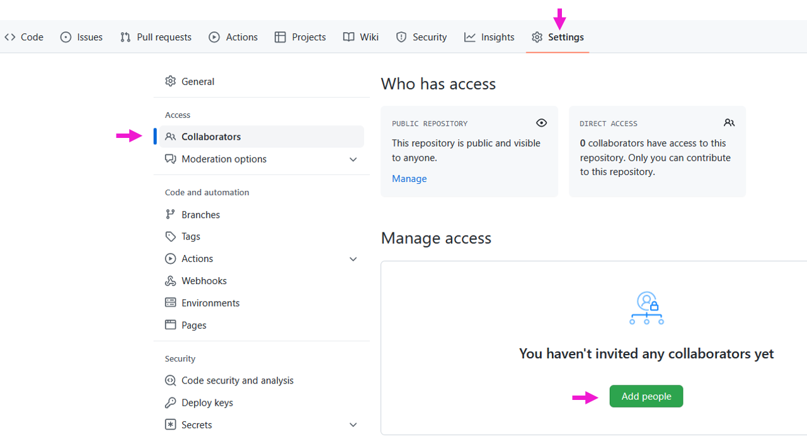

```{r setup, include=FALSE}
options(htmltools.dir.version = FALSE)
knitr::opts_chunk$set(
  fig.width=9, fig.height=3.5, fig.retina=3,
  out.width = "100%",
  cache = FALSE,
  echo = TRUE,
  message = FALSE, 
  warning = FALSE,
  error = TRUE
#  hiline = TRUE
)
library(xaringan)
library(xaringanExtra)
library(xaringanthemer)
library(tidyverse)
library(knitr)
library(here)
library(kableExtra)
library(fontawesome)
library(countdown)
library(gt)

table_style <- function(data) {
  data %>%
    opt_table_lines(extent = "none") %>%
    opt_table_outline(style = "solid", width = px(3), color = "black") %>% 
    tab_options(
      heading.border.bottom.color = "black",
      heading.border.bottom.style = "solid",
      table.border.top.color = "black",
      table_body.hlines.color = "black",
      table_body.border.top.color = "black",
      table_body.border.top.style = "solid",
      table_body.border.bottom.color = "black",
      table_body.border.bottom.style = "solid",
      column_labels.border.bottom.color = "black",
      column_labels.border.bottom.style = "solid",
      column_labels.border.top.color = "black",
      column_labels.background.color = "#56B4E9",
      table.width = pct(100),
      container.width = pct(100)
    )
}
```

```{r xaringan-themer, include=FALSE, warning=FALSE}
library(xaringanthemer)

style_duo_accent(
  primary_color = "#1F4E79",
  secondary_color = "#0072B2",
  header_font_google = xaringanthemer::google_font("Atkinson Hyperlegible", "600"),
  text_font_google   = xaringanthemer::google_font("Atkinson Hyperlegible", "300", "300i"),
  code_font_google   = xaringanthemer::google_font("IBM Plex Mono"),
  colors = c(
    darkblue = "#0072B2",
    lightblue = "#56B4E9",
    darkorange = "#D55E00",
    lightorange = "#E69f00",
    yellow = "#f0e442",
    green = "#009E73",
    pink = "#CC79A7",
    white = "#FFFFFF",
    red = "#ff0000"
  )
)
```

```{r xaringanExtra-freezeframe, echo=FALSE}
xaringanExtra::use_freezeframe()
```

class: inverse, left, middle

# git & GitHub
## Week 6

---

# Agenda

* Introduce reasons for version control
* Introduce
  + git
  + GitHub
  + GitKraken

**Learning Objectives**

* ~~Understand~~ Introduce the basics of git and git terminology
* Be able to create *.green[repos]*, *.green[commit]* changes, *.green[push]*, *.green[clone]*, and *.green[pull]*
* Be prepared to collaborate on a project

---

# git & GitHub

#### What are they?

.pull-left[
**git**
```{r, echo=FALSE, out.width='10%'}
knitr::include_graphics("https://git-scm.com/images/logos/logomark-orange@2x.png")
```
* a version control system
* lives on your computer and keeps track of files and all changes made to them that you register with *.green[commits]*
]

.pull-right[
**GitHub**
```{r, echo=FALSE, out.width='10%'}
knitr::include_graphics("https://upload.wikimedia.org/wikipedia/commons/thumb/9/91/Octicons-mark-github.svg/600px-Octicons-mark-github.svg.png")
```
* an online host for *.green[repositories]* of code and data
* lives on the internet
]

.footnote[
Credit [Nathan Brouwer](https://mobile.twitter.com/lobrowR)
]

---
# git & GitHub

#### Why are they important?

**Backup**: Easy way to upload files and add notes about changes. Excellent way to keep all your R work backed-up on the cloud

.footnote[
Credit [Nathan Brouwer](https://mobile.twitter.com/lobrowR)
]

--

**Version Control**: Complete history of all changes and why they were made, and multiple branches of history

--

**Open Access**: Open, transparent, and public science. Some journals allow GitHub sites to be used to host data and code to meet their open-access requirements

--

**Visibility**: GitHub makes it easy to make your open-access work visible to people who might be interested (collaborators, employers)

--

**Collaborative tool**: Git and GitHub are designed for collaboration (even if you’re the only one coding). Easy to share files between collaborators, allows for merging work and reconciling conflicts.

--

**Job Skill**: This is an important data science skill

---
# git & GitHub

#### How?

1. Install git
2. Create a GitHub account (hopefully you all have done this)
3. Get a GUI and/or learn the command-line tools
  + I'm okay with either or both, as long as you (sort of) know what you're doing
  + We’re going to use [GitKraken](https://www.gitkraken.com/) in this course 
4. Develop a solid understanding of the underlying structure, so you know what you want to do even if you don't know how
  + *.green[commit]*, *.green[push]*, *.green[pull]*, *.green[fork]*

---
background-image: url(https://res.cloudinary.com/practicaldev/image/fetch/s--t4yzzdh2--/c_limit%2Cf_auto%2Cfl_progressive%2Cq_auto%2Cw_880/https://dev-to-uploads.s3.amazonaws.com/i/pgwreddlj4a1m16bjnzm.jpg)
background-size: contain

---
## git can be frustrating, but...

It is transparent – mistakes and all

Can be a powerful tool for collaboration

* Communication between team members is important
* Try to avoid merge conflicts
  - One person working on one thing at a time
  - *.green[Pull]* first each and every time!
  - *.green[Push]* often/at logical points


Excellent for reproducibility (a tenet of the data science pipeline)

* Open data and code
* Transparent 
* Forking paths

---
## Notes on Open & Reproducible Research

* Use scripting
* Use dynamic documents 
  + R Markdown is fantastic
  + Better than Jupyter notebooks; see [here](https://docs.google.com/presentation/d/1n2RlMdmv1p25Xy5thJUhkKGvjtV-dkAIsUXP-AL4ffI/edit#slide=id.g362da58057_0_1) and [here](https://yihui.name/en/2018/09/notebook-war/)
* Use Git/GitHub
* Use open data whenever possible
  + Consider ways you can make portions of the data open, if not all of it
* Advanced – use tools that store software versions
  + `{renv}` (Rstudio)
  + `{target}` (formely drake)
  + `{holepunch}` 

---
# All the things

* **git** – a version control system that lives on your machine
* **GitHub** – repo host that lives online, works with git
* **GitKraken** – a GUI that lives on your machine and communicates with GitHub and git

---
# Version Control

We can think of the changes as separate from the document

You can then think about “playing back” different sets of changes on the base document, ultimately resulting in different versions of that document

```{r, echo=FALSE, out.height='50%'}
knitr::include_graphics("https://swcarpentry.github.io/git-novice/fig/play-changes.svg")
```

.footnote[
[swcarpentry](https://swcarpentry.github.io/git-novice/01-basics/index.html)
]

---
# Version Control

This means there are many possible versions of the same document

```{r, echo=FALSE, out.width='50%', fig.align="center"}
knitr::include_graphics("https://swcarpentry.github.io/git-novice/fig/versions.svg")
```

.footnote[
[swcarpentry](https://swcarpentry.github.io/git-novice/01-basics/index.html)
]

---
# Version Control

Unless there are .red[merge conflicts], two changes from the same document can be merged together

```{r, echo=FALSE, out.width='50%', fig.align="center"}
knitr::include_graphics("https://swcarpentry.github.io/git-novice/fig/merge.svg")
```

.footnote[
[swcarpentry](https://swcarpentry.github.io/git-novice/01-basics/index.html)
]

---
# Let's talk about "how"

* Understand the structure of git
* Actual method of completing the tasks is up to you
  + GUI? Command line? RStudio?
* I’ve asked you to install [GitKraken](https://www.gitkraken.com/)
  + Worth it to manage merge conflicts alone
* If you’re already using something else, that’s ok!
  + Let me know

---
background-color: #009E73

# Terminology

--

* <b>version control system</b>
  + A tool to help us track changes. git is one such system (but there are others)

--
* <b>repository (repo)</b>
  + The files, full commit history, and associated metadata for a project

--
* <b>remote</b>
  + The cloud-based server hosting the repo (that's GitHub)

---

```{r, echo=FALSE, out.height='75%', out.width='75%', fig.align='center'}

```


---
class: inverse, left, middle

## Let's connect GitHub and GitKraken

---
# Connect GitHub & GitKraken

### Go to GitKraken

1. "Sign in with GitHub"

2. "Continue with Authorization"

3. You should see *“Success: GitHub and GitKraken are good to go!”* or something like that

4. Check your email for an email from GitHub to verify (?)

---
# Open GitKraken

```{r, echo=FALSE}

```

---
# Connect GitHub and GitKraken

```{r, echo=FALSE, out.height='75%', out.width='75%'}

```

---
# Connect GitHub and GitKraken

Check your email (associated with your GitHub account)

```{r, echo=FALSE, out.height='75%', out.width='75%'}

```

---
class: inverse, left, middle

# Incorporating git/GitHub/GitKraken
## into your data science workflow

---
# Proposed Workflow

1. Create your RStudio Project (as usual)

2. **GitKraken**: Open a *.green[repo]* on GitKraken

3. **GitHub**: Create new *.green[repo]* on GitHub

4. **GitKraken**: Add *.green[remote]* on GitKraken

---
# 1. Create your RStudio Project (as usual)

* Let’s make a new RStudio Project (cal it "*week6*")
  + Open a new R Markdown document and name it "*foo*"

* Note the name you gave the project (folder)

* ✔️ *"Create a git repository"*
  + If ✔️: Don't add `.gitignore` in GiKraken or GitHub  
  + If 🚫: Add `.gitignore` in GitKraken **or** GitHub

---
# 1. Create your RStudio Project (as usual)

* Let’s make a new RStudio Project
  + Open a new R Markdown document and name it "*foo*"

* Note the name you gave the project (folder)

* *"Create a git repository"*
  + .bg-yellow[If ✔️: Don't add `.gitignore` in GiKraken or GitHub]
  + If 🚫: Add `.gitignore` in GitKraken **or** GitHub

---
# 2. Open a repo on GitKraken

### GitKraken

* Open a *.green[repo]*

* Init

* Local only

---
# Open a repo (GitKraken)

```{r, echo=FALSE}

```

---
# Open a repo (GitKraken)

```{r, echo=FALSE}

```

---
# Open a repo (GitKraken)

* *"Name"*
  + folder name where the Rproject lives
* *"Initialize in"*
  + Browse to the <u>parent</u> folder where your Rproject lives
* *"Full path"*
  + *"Full path"* = *"Initialize in"* + *"Name"*
  + The full path should read to the path where your Rproject lives
* *"Default branch name"*
  + "main"
* *".gitignore Template"*
  + .bg-yellow[If already created one with your project, leave empty]
  + If none yet created, choose "R"
* *"License (optional)"*
  + MIT License

---
# Open a repo (GitKraken)

```{r, echo=FALSE}

```

---
# 3. Create new repo on GitHub

### GitHub

(1) Create new *.green[repo]*
  + <b>Repository name</b> – same as your Project name
  + <b>Description</b> – keep it brief, informative
  + <b>Public</b>
  + <b>Do not initialize</b>
  + <b>"None"</b> 
  + do **NOT** add `.gitignore` 
  + do **NOT** add a license

(2) Copy URL from GitHub

---
# 3. Create new repo on GitHub

```{r, echo=FALSE}

```

---
# 3. Create new repo on GitHub

```{r, echo=FALSE}

```

---
# Copy URL from GitHub

```{r, echo=FALSE}

```

---
# 4. Back to GitKraken to Add Remote

### GitKraken

Add .green[REMOTE]
* Same Name used thus far

* Click `r fontawesome::fa(name = "globe")` *"URL"*

* Paste URL

---
# REMOTE


```{r, echo=FALSE}

```

---
# Paste URL into "Pull URL"

* Same Name used thus far

* Click `r fa(name = "globe")` *"URL"*

* Paste URL

```{r, echo=FALSE, out.height='50%', out.width='50%'}

```

---
class: inverse, left, middle

# Let's see what we've done

---
# Navigate to the folder

* Where did you save your *.green[local]*?

--

.pull-left[
If you don’t see the `.git` folder
]

.pull-right[
```{r, echo=FALSE, out.width='50%'}

```
]

---
# Tracking

* As long as the `.git` folder exists, the entire folder will be tracked

* **Do not** create .green[repos] inside of .green[repos]

* If you want a folder to show up, there needs to be something in it (e.g., a README.md)

---
# Ignoring files

* When we created the .Rproj the .green[repo], we started it with a `.gitignore` file

* The `.gitignore` file tells the .green[repo] not to track certain files
  + e.g., proprietary data
  
* Not that important for now, but if you need to ignore a file in your .green[repo] for whatever reason, just put the name of the file(s) at the top of the `.gitignore` file

* Or, create a folder in your .Rproj (e..g, `nopublish`) and put all your documents to be ignored in that file
  + then on the first line of your `.gitignore` file, type:
<br><br>&nbsp;&nbsp;*nopublish/**

---
# Homework 6

Submit a link to the .green[repo] you created
* Upload the link to Canvas

* See me if you were unable to complete in class (for technical reasons etc.)

It is ok if you leave today a ~~little~~ lot confused!

---
background-color: #009E73

# Terminology

--

* <b>Stage</b>
  + A file that is being prepared for a commit

--
* <b>Commit</b>
  + Changes that have been made to the file(s)

--
* <b>Push</b>
  + After you commit the changes you want, push them from the local to the remote

--

Half the battle is learning these terms

--

.darkorange[[demo]]

---
background-image: url(images/bryan_2.png)
background-size: contain

.footnote[
Image from Bryan (2017)
]

---
# Pull

```{r, echo=FALSE, out.width='100%'}

```


* **.green[Pull]** before you start any collaborative work!!

* **.green[Pull]** any accepted changes from the remote to your local

--

**.green[Pull] before you start any collaborative work!!**

---
# Collaborating

Two methods

1. Add users to a .green[repo]
  + *Settings > Collaborators > Manage Access > Add people* (add user with username)

2. Create an organization

--

```{r, echo=FALSE, out.width='50%'}

```

---
# Collaborating

Two methods

1. .bg-yellow[Add users to a .green[repo]]
  + *Settings > Collaborators > Manage Access > Add people* (add user with username)
2. Create an organization

---
# Collaborating

<b>Final Project</b>

.bg-yellow[Add users to a .green[repo]]

1. One group member will Open a .green[repo] (like we just went over)
  + Potentially the person who has the project data, but not necessarily
2. Within the .green[repo] on GitHub<br>
  *Settings > Collaborators > Manage Access > Add people* (add user with username)

--


```{r, echo=FALSE, out.width='50%'}

```

---
# Collaborating

* The collaborators will receive an email from GitHub

* Accept the invitation

* *.green[Clone]* the repo

---
# Cloning

* *.green[Cloning]* means that you are downloading the repo
* You can *.green[clone]* any repo you like (like the `{tidyverse}`)
* For the final project, you will *.green[clone]* the repo you were invited to collaborate on

--

```{r, echo=FALSE}
knitr::include_graphics("images/gh_clone.png")
```

---
# Clone a repo

(1) Go to the repo on GitHub

(2) Click the green *"Code"* button near the top

(3) Copy the URL 

```{r, echo=FALSE, out.width='50%'}
knitr::include_graphics("images/gh_clone.png")
```

---
# Clone a repo

(4) Go to GitKraken

(5) Clone > `r fa(name = "globe")` Clone with URL

(6) Specify where it will live on your machine (*"Where to clone to"*)

(7) Paste in the copied URL

(8) Click *"Clone the repo!"*

```{r, echo=FALSE, out.width='50%'}

```

---
class: inverse, left, middle

# Merge Conflict

---
background-image: url(https://www.meme-arsenal.com/memes/cce345428b0f8c83b92d4a0d958467f3.jpg)
background-size: contain

---
# Merge Conflicts

* Always **.green[pull]** before you start working!!

* Try to stay in communication with your collaborators and don't work on the exact same thing at the same time

* Use GitKraken to help manage .red[merge conflicts] that do come up

---
# Merge Conflicts

* Remember to always **.green[pull]** first!!

* GitKraken has a really nice GUI to resolve .red[merge conflicts]

<iframe width="560" height="315" src="https://www.youtube.com/watch?v=R1iWJNyRpQE" frameborder="0" allow="accelerometer; autoplay; encrypted-media; gyroscope; picture-in-picture" allowfullscreen></iframe>

[link](https://www.youtube.com/watch?v=R1iWJNyRpQE)

---
# Merge Conflicts

Let's give this a shot

---
# Merge Conflict Activity (15 mins)

1. Get a partner

2. .pink[Partner1] open in GitHub the .green[repo] you made in class

3. .pink[Partner1] add .lightorange[Partner2] as a collaborator in GitHub

4. .lightorange[Partner2] .green[clone] the repo

5. .pink[Partner1] make changes to the *foo.Rmd* file in the .green[repo]
  + .green[commit] and .green[push] those changes

6. .lightorange[Partner2] **do NOT .green[pull]**

7. .lightorange[Partner2] make different changes to the same parts of the *foo.Rmd* file
  + .lightorange[Partner2] commit the changes. Try to push. What happens? Why?
  
8. Use GitKraken to deal with the .red[merge conflicts]

```{r, echo=FALSE}
countdown(minutes = 15, seconds = 0, bottom = 0, warn_when = 120)
```

---
# Merge Conflict Activity (15 mins)

(2) .pink[Partner1] open in GitHub the .green[repo] you made in class

(3) .pink[Partner1] add .lightorange[Partner2] as a collaborator in GitHub

(3) .lightorange[Partner2] open email associated with GitHub to accept invitation

(4) .lightorange[Partner2] .green[clone] the .green[repo]
  + **GitHub**
  + Copy URL (click clipboard icon)
  + **GitKraken**
  + Clone with URL
  + Paste in URL
  + Choose place where .green[repo] will live on your machine (.green[local])
  
```{r, echo=FALSE}
countdown(minutes = 15, seconds = 0, bottom = 0, warn_when = 120)
```

---
# Merge Conflict Activity (15 mins)

(5) .pink[Partner1] open RRtudio
  + Make changes to the *foo.Rmd* file in the .green[repo]
  + .green[commit] and .green[push] those changes

(6) .lightorange[Partner2] **do NOT .green[pull]**

(7) .lightorange[Partner2] 
  + make different changes to the same parts of the *foo.Rmd* file
  + .lightorange[Partner2] .green[commit] the changes to local
  + Try to .green[push] 
  + What happens? Why?
  
(8) Use GitKraken to deal with the .red[merge conflict]

```{r, echo=FALSE}
countdown(minutes = 15, seconds = 0, bottom = 0, warn_when = 120)
```

---
# Quick Recap

Basic workflow
* create an RStudio project
* create a .green[repo]
* add collaborators
* *.green[pull]*
* *.green[stage]* and *.green[commit]* changes
* *.green[push]* changes to *.green[remote]*

---
# Revisiting git terminology

Talk with a neighbor about what each of these terms mean
* .green[clone]
* .green[pull]
* .green[stage]
* .green[commit]
* .green[push]
* .green[repo]
* .green[remote]

---
class: inverse, left, middle

# Next time

---
# Before next class

* Homework
  + **Homework 6** (hopefully completed in class today)
  + **Homework 7**
* Supplemental Learning
  + [RStudio Primer: Join Data Sets](https://rstudio.cloud/learn/primers/4.3)
  + [Codecademy: Joining Tables in R](https://www.codecademy.com/courses/learn-r/lessons/r-multiple-tables/exercises/introduction)

---
class: inverse, left, middle

# Homework 7

---
class: inverse, left, middle

---

```{r, echo=FALSE, eval=FALSE}
renderthis::to_pdf(here::here("slides", "w6_git.html"), complex_slides = TRUE)
```
