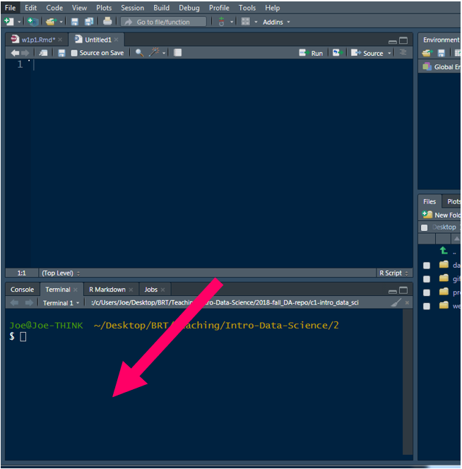
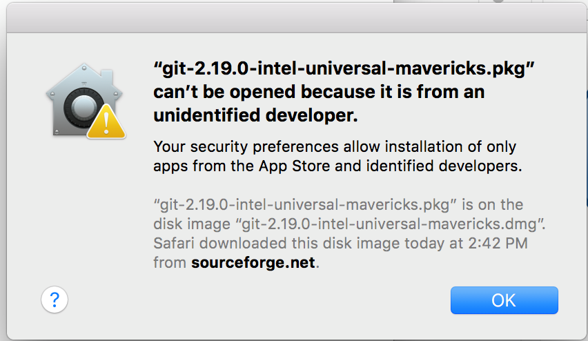
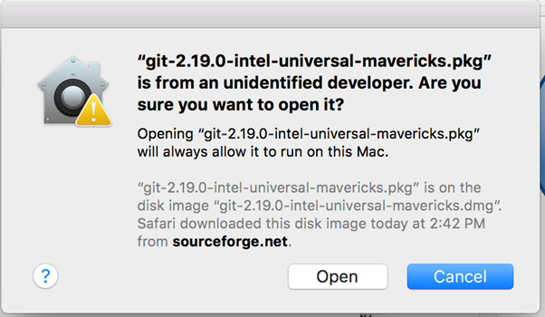

```{r setup, include=FALSE}
knitr::opts_chunk$set(echo = FALSE,
                      warning = FALSE,
                      message = FALSE)
```

Please complete the following **five** items before our first class. 

<br>
<br>

## (1) Install R*

#### https://cloud.r-project.org/ 

Install `R` from CRAN, the Comprehensive R Archive Network

<br>
<br>

## (2) Install RStudio*

#### https://www.rstudio.com/products/rstudio/#Desktop 

**<span style="font-size:200%;">\*</span>Note**: If you have a pre-existing installation of `R` and/or RStudio, I strongly recommend that you reinstall both and get as current as possible. It can often be problematic to run old software.

If you upgrade `R`, you will need to update any packages you have installed. The command below should get you started, but you might also need to specify more arguments if you have been using a non-default library for your packages.

`update.packages(ask = FALSE, checkBuilt = TRUE)`

This will only look for updates on CRAN. So if you use a package that lives only on GitHub or if you want a development version from GitHub, you will need to update it manually via `devtools::install_github()`

<br>
<br>

## (3) Register a GitHub account

#### https://github.com

Before you register for your free GitHub account, please read this [username advice](https://happygitwithr.com/github-acct.html) from Jenny Bryan.

<br>
<br>

## (4) Install Git

#### https://www.git-scm.com/download  

Be sure to download the version of Git that is appropriate for your operating system (Mac, Windows, Linux).

That should give you an installer. (If you have a Mac and you’re having a hard time opening the installer, please see [below](#issues).

Note that Git is not like other software. You will not have an app to launch. To ensure the installation was successful, open RStudio after running the installer, go to: 
	
**Tools > Terminal > New Terminal **

```{r out.width = '50%'}
knitr::include_graphics("img/install_1.png")
```

This will give you a new window down by your console.

```{r out.width = '50%'}

```

Type the following into the terminal, then press enter: `git --version` (see highlighted box in image below)

```{r out.width = '50%'}
knitr::include_graphics("img/install_3.png")
```

If Git has been installed correctly, you should see output stating the version of Git that is installed on your machine. If you get this output, you are set for when we discuss git. **If you do not get similar output please let me know before Week 7.** It is critical that everyone be ready to go prior to class Week 7 so we don’t have to waste time in class on installation issues.

#### See below for issues related to Macs and permissions related to the developer {#issues}

**If you have a Mac**

Your computer will likely not trust the developer and you will get a message like the below when you try to run the installer. 

```{r out.width = '50%'}

```

To get around this, you’ll need to right click (`Control + click`) on the installer and select “Open”. Then you’ll be able to open and run the installer.

```{r out.width = '50%'}
knitr::include_graphics("img/install_5.png")
```

```{r out.width = '50%'}

```

<br>
<br>

## (5) Install GitKraken

#### https://www.gitkraken.com/download
