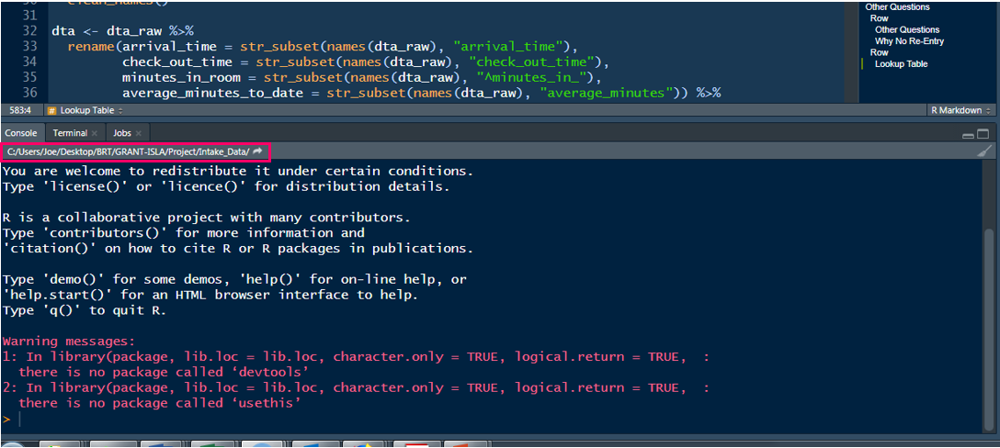

```{r setup, include=FALSE}
options(htmltools.dir.version = FALSE)

library(xaringan)
library(xaringanthemer)
library(tidyverse)
library(knitr)
library(here)
library(kableExtra)
library(janitor)

```

```{r xaringan-themer, include=FALSE, warning=FALSE}
style_duo_accent(
  primary_color = "#1F4E79",
  secondary_color = "#0072B2",
  header_font_google = google_font("Atkinson Hyperlegible", "600"),
  text_font_google   = google_font("Atkinson Hyperlegible", "300", "300i"),
  code_font_google   = google_font("IBM Plex Mono"),
  colors = c(
    darkblue = "#0072B2",
    lightblue = "#56B4E9",
    darkorange = "#D55E00",
    lightorange = "#E69f00",
    yellow = "#F0E442",
    green = "#009E73",
    pink = "#CC79A7",
    gray = "999999",
    white = "#FFFFFF",
    black = "#000000"
  )
)

```

# UO Libraries [Data Services](https://library.uoregon.edu/data-services)
 
The UO Libraries’ [Statistical Help Desk](https://library.uoregon.edu/research-data-management/consultations) is available this term Monday - Friday 11 am - 4 pm in the [DREAM Lab](https://map.uoregon.edu/f36893138) and by [appointment](https://library.uoregon.edu/research-data-management/consultations) (in person or via Zoom). We offer help with statistics, statistical software like R, SPSS, Python, research design, GIS, git/GitHub, SQL, Zotero, and qualitative software such as Dedoose. 
 
The library also offers free short [workshops.](https://uoregon.libcal.com/calendar/dataservices/?cid=11979&t=d&d=0000-00-00&cal=11979,5245,11173,15812,6522&inc=0) This term, we are offering workshops on [R](https://uoregon.libcal.com/calendar/dataservices/?t=d&q=&cid=11979&cal=11979,5245,11173,15812,6522&ct=47734&inc=0), [Python](https://uoregon.libcal.com/calendar/dataservices/?cid=11979&t=d&d=0000-00-00&cal=11979,5245,11173,15812,6522&ct=47735&inc=0), [GitHub](https://uoregon.libcal.com/calendar/dataservices/github_s2022), using [Zotero](https://uoregon.libcal.com/calendar/dataservices?cid=11979&t=d&d=0000-00-00&cal=11979,11173,15812,6522&ct=47818&inc=0) to manage your citations, and [more](https://uoregon.libcal.com/calendar/dataservices?cid=11979&t=d&d=0000-00-00&cal=11979,11173,15812,6522&inc=0). Our Friday lunch chats ([Coffee + Data && Code](https://uoregon.libcal.com/calendar/dataservices/?cid=11979&t=d&d=0000-00-00&cal=11979,5245,11173,15812,6522&ct=61628&inc=0)) offer a great opportunity to meet folks interested in data and code from across the university. 

---

## Housekeeping

* assignments
* breaks

---
class: inverse, left, middle

# Workflow
## Week 2

---

# Agenda

* Project Oriented Workflow
  + RStudio Projects
  + File paths
  + Reading in data
  + Scripts (.R & .Rmd)
  + Loading packages
* Looking at data
* The pipe `%>%`
  + also `|>`

**Learning Objectives**

* Open an RStudio Project
* Understand file paths
* Learn two ways to read data
* Establish good workflow habits

---
class: inverse, left, middle

# RStudio Projects

---

# RStudio Projects (.Rproj)

An RStudio project - .Rproj - is basically a folder to house all the files for your project
* scripts
* products
* data
* figures

--

**Advantages**

* Work with several projects at the same time (several projects open)
  + these are self-contained!
* Can save the history of your commands after quitting
* Can specify version control system (e.g., Git)
* Previously edited code tabs are restored upon opening
* The current **working directory** is set to the project directory

---

# What's a working directory?

Where you're at on your computer
* the folder location
* *Quick check-in*: does this make sense?

You *can* change your working directory with `setwd("path/to/files")`...

...**BUT** I strongly urge you to avoid that

Instead, we’re going to use RStudio Projects and the `{here}` package

You can `list.files("path/to/files")` to see the contents of your project directory (i.e., what your computer "sees")

--

* See where you're currently at by looking at the top of the console
* Or run `getwd()` in the console
--


---

# What's different with .Rproj?

Your working directory is immediately wherever your `.Rproj` project is located

This is true for whoever is accessing the project

Use the `{here}` package to specify **paths**
* You can read/save data (and figures, products, etc.) which we'll talk about more later

---

.pull-left[
### `setwd()`

Sets working directly

* `setwd()` ONLY works for you
* Can’t share it out without A LOT of code editing
* `setwd()` makes it difficult to work on other projects with different directories
  + You have to remember to change it
  + Or work leaks across projects (objects, data, packages)

Instead: **`here()`**
]

--

.pull-right[
### `rm(list = ls())`

Removes objects in environment

* Does NOT create a fresh R process
* Only deletes user-created objects
* Packages are still loaded!
* Options that have been reset in code still exist
* Your script is not self-contained!
* Not friendly to your collaborators! (deletes their objects)

<br>

Instead: **Session > Restart R** (`Ctrl/Command + Shift + F10`)
]

---
background-size: contain

background-image: url("./images/hadley-tweet_1.png")

---

# Project Oriented Workflow

**Solution**: Write every script assuming it will be run in a fresh `R` process

--

1) Do not save `.RData` when you quit `R` and don’t load `.RData` when you start `R`

Week 1: **Tools 🡆 Global Options...**

General
* Workspace
  + "*Restore .RData into workspace at startup*" -- **Uncheck**
  + "*Save workspace to .RData on exit:*" -- **Never**

--

2) Daily work habit: 
  + Restart `R` very often and re-run your developing script from the top
  + Use the RStudio menu item: **Session > Restart R** (`Ctrl/Command + Shift + F10`)

---
class: inverse, left, middle

# Workflow

---

## Let’s start by making a new project

Typical workflow

1. Make a new .RProj
2. Add folders
  + "data"
  + "scripts"
3. Read in data
4. Create scripts
5. Load packages

---
class: inverse, left, middle

# RStudio Project

---
# 1. Make a new .RProj

*File* > *New Project...*

or

upper right of RStudio IDE by the `R` cube

down arrow > *New Project...*

---
# 1. Make a new .RProj

Let’s name it: "my_first_project"
* notice the naming convention
  + no caps
  + no spaces
  + no special characters (e.g., `?`, `!`, `"`, `#`)
  + "`_`" and "`-`" are ok
  
--
  
Choose a location for it
* An .RProj will need its own folder, with no other projects in it!
* Projects in Dropbox often lead to unexpected occurences

--

I'll just save "my_first_project" to my desktop

**.darkorange[[demo]]**

---
class: inverse, left, middle

# Organize

---

# 2. Create folders

Let’s make two folder in different ways (either is fine)

**data**
* where we will store all our project-related data
* let’s create that in Rstudio

**scripts**
* where we will hold all our scripts (.R or .Rmd files)
* let’s create that in the folder on our machine

**.darkorange[[demo]]**

---
class: inverse, left, middle

# Reading Data

---
# Dowload data

Let’s save the following data files into our project "data" folder

*go [here](https://uo-datasci-specialization.github.io/c1-intro-fall-2022/data_list.html) to download*

1. ecls-k_samp.sav
2. Fatality.txt
3. Project_Reads_Scores.csv

---

# Reading data into `R` 

You just need one thing:

1. **where** the data is located

--

This is most often just a path on you machine

--

We'll be talking about two data reading packages

1. `{rio}`
2. `{readr}`

---
<div>
    <p style="float: right;"></p>
    <p><h1>Data Location?</h1></p>
</div>

### We’ll use the `{here}` package

`{here}` uses the top-level directory of a project to easily build **paths** to files

* Allows you to worry about paths a little less
* Helps reproducibility
* Your final project!

Think of `here()` simply as a function to print a path name

A **path** can be the **location** of your data

.footnote[
Art: [Allison Horst](https://www.allisonhorst.com/)
]

--

**path** = **location**

---
# [`{here}`](https://here.r-lib.org/)

Think of `here()` simply as a function to print a path name

First, install/load the package

```{r, eval=FALSE}
# In the console: 
# install.packages("here")
# Then, load the package
library(here)
```

---

# [`{here}`](https://here.r-lib.org/)

Think of `here()` simply as a function to print a path

Run this code in your project (console is fine)

```{r, eval=FALSE}
here()
```

--

This is the "top level" directory of our project

---
# [`{here}`](https://here.r-lib.org/)

Think of `here()` simply as a function to print a path name

Run this code in your project (console is fine)

```{css, echo=FALSE, eval=FALSE}
pre {
  max-width: 100%;
  overflow-x: scroll;
}
```

```{r}
here()
```

--

This is the "top level" directory of **my** project

---
# [`{here}`](https://here.r-lib.org/)

Think of `here()` simply as a function to print a path

Run this code in your project (console is fine)

```{r, eval=FALSE}
here()
```

```{r, eval=FALSE}
here("data")
```

--

This is the path to the "data" folder in our project directory

---

# [`{here}`](https://here.r-lib.org/)

Think of `here()` simply as a function to print a path name

Run this code in your project (console is fine)

```{r, eval=FALSE}
here()
```

```{r, eval=FALSE}
here("data")
```

**Question:** What was the difference in the output between these?

--

**Question:** What will the following produce?

```{r, eval=FALSE}
here("data", "ecls-k_samp.sav")
```

---

### Let's see files are in our "data" folder

`list.files(here("data"))`

You can also use the *Files* tab in RStudio

--

Use `here()` to access data or any file in your project

--

`here()` is simply a function to print a path

--

**.darkorange[[demo]]**

---
# `{rio}`

* `{rio}` is a wrapper around many different packages that import/export data in different formats

* Great package

* Most of the time "it just works" regardless of the source file type
  + this might not impress you, but it really should! 
  + any package that turns a complex task into a simple procedure that "just works" is invaluable

---
# [`import()`](https://cran.r-project.org/web/packages/rio/vignettes/rio.html)

.darkblue[import](.darkorange[file], .pink[format], .green[setclass], ...)

.darkorange[file]       = character string naming a file

--

.pink[format]           = (*optional*) character string of file format; e.g., `","` for comma-separated values

.green[setclass]      = (*optional*) character vector specifying one or more classes to set on the import. Default is `"data.frame"`. We would probably prefer `"tbl_df"` for a `tibble`

---

# 3a. Read in data

Try it!

```{r}
library(rio)

# .sav
eclsk <- import(here("data", "ecls-k_samp.sav"), setclass = "tbl_df")

# Use `as_tibble` instead of `setclass = "tbl_df"`

# .txt
fatality <- import(here("data", "Fatality.txt")) %>% 
  as_tibble()

#.csv
exam1 <- import(here("data", "Project_Reads_Scores.csv")) %>% 
  as_tibble()

```

---

### You can even read directly from the web 😲

#### Fatality.txt

```{r}
import("https://raw.githubusercontent.com/uo-datasci-specialization/c1-intro-fall-2022/master/data/Fatality.txt",
       setclass = "tbl_df")
```

---
# [`export()`](https://cran.r-project.org/web/packages/rio/vignettes/rio.html)

Save data just as easily with `export()`

--
#### You need two things:

1. .green[What] to export?
2. .darkorange[Where] to export?

.darkblue[export](.green[x], .darkorange[file], .pink[format], ...)

.green[x]      = data frame (tibble) to be written into a file

.darkorange[file] = character string naming a file

---
# [`export()`](https://cran.r-project.org/web/packages/rio/vignettes/rio.html)

Save data just as easily with `export()`

#### You need two things:

1. .green[What] to export?
2. .darkorange[Where] to export it?

.darkblue[export](.green[x], .darkorange[file], .pink[format], ...)

.green[x]      = data frame (tibble) to be written into a file

.darkorange[file] = character string naming a file

```{r, eval=FALSE}
export(exam1, here("data", "exam1.sav"))

export(exam1, here("data", "exam1.txt"))

export(exam1, here("data", "exam1.dta"))
```

---
# `convert()`

Another really useful feature is `convert()`, which just takes a file of one type and converts it to another

Say your advisor uses SPSS, but their colleague uses Stata (and you use `R` 😎)

---
# `convert()`

Another really useful feature is `convert()`, which just takes a file of one type and converts it to another

Say your advisor uses SPSS, but their colleague uses Stata (and you use `R` 😎)

Just run one line of code!

.darkblue[convert](.green[in_file], .pink[out_file], ...)

.green[in_file] = character string naming an input file

.pink[out_file] = character string naming an output file

.darkorange[convert](here("data", .green["ecls-k_samp.sav"])),<br>
&emsp;&emsp;&emsp;&emsp;&nbsp;(here("data", .pink["ecls-k_samp.dta"]))

---

# How is this all working?

`{rio}` wraps a variety of faster, more stream-lined packages than those provided by base `R` 
* `{data.table}` for delimited formats
* `{haven}` for SAS, Stata, and SPSS files
* `{readxl}` and `{openxlsx}` for reading and writing Excel workbooks
* `data.table::fread()` for text-delimited files to automatically determine the file format regardless of the extension
  + also *very* fast
--

* again, "just works"

---

# Maintaining labels

**Question: How many of you or your colleagues use SPSS or Stata?**

--

In SPSS, numeric data are often encoded with labels

`{rio}` and `{haven}` allow you to transform the data into the character/factor version

`{rio}` and `{haven}` store metadata from rich file formats (SPSS, Stata, etc.) in variable-level attributes in a consistent form regardless of file type or underlying import function 
* `rio::characterize()` converts a single variable or all variables in the data that have *label* attributes into character vectors
* `rio::factorize()` does the same but returns factor variables

---

```{r, eval=FALSE}
eclsk %>%
  select(child_id, k_type:sex) %>%
  head()
```

--

```{r, echo=FALSE, highlight.output = c(3)}
eclsk %>%
  select(child_id, k_type:sex) %>%
  head()
```

---
```{r, eval=FALSE}
eclsk %>%
  select(child_id, k_type:sex) %>%
  head()
```

---

```{r, eval=FALSE}
eclsk %>%
  characterize() %>% #<<
  select(child_id, k_type:sex) %>%
  head()
```

--

```{r, echo=FALSE, highlight.output = c(3)}
eclsk %>%
  characterize() %>% #<<
  select(child_id, k_type:sex) %>%
  head()
```

--

```{r, highlight.output = c(3)}
eclsk %>%
  select(child_id, k_type:sex) %>%
  head()
```

---

# [`{readr}`](https://readr.tidyverse.org/)

* Great package; most of the time "it just works" regardless of the source file type
* Loads with `{tidyverse}`
* Default loads data as a `tibble`
  + this is nice!
--
<br>
<br>
* [`read_csv()`](https://readr.tidyverse.org/reference/read_delim.html):   comma separated (CSV) files
* [`read_tsv()`](https://readr.tidyverse.org/reference/read_delim.html):   tab separated files
* [`read_delim()`](https://readr.tidyverse.org/reference/read_delim.html): general delimited files
* [`read_fwf()`](https://readr.tidyverse.org/reference/read_fwf.html):   fixed width files
* [`read_table()`](https://readr.tidyverse.org/reference/read_table.html): tabular files where columns are separated by white-space
* [`read_log()`](https://readr.tidyverse.org/reference/read_log.html):   web log files

---
# [`read_csv()`](https://readr.tidyverse.org/reference/read_delim.html)

You just need one thing:

1. .darkorange[where] the data is located


.darkblue[read_csv](.darkorange[file], ...)

.darkorange[file]       = a **path** to a file, a connection, or literal data (either a single string or a raw vector)

--

**And how do we get a path string?**

--

with the `here()` function

---

# 3b. Read in data

Try it!

```{r, eval=FALSE}
library(tidyverse)

# {haven} package
eclsk <- haven::read_sav(here("data", "ecls-k_samp.sav"))

# read_table() for space separated data
fatality <- read_table(here("data", "Fatality.txt")) 

#read_csv(), the one I most often use
exam1 <- read_csv(here("data", "Project_Reads_Scores.csv"))

# read directly from the web, in this case a .csv
web <- read_csv("https://github.com/datalorax/ncme_18/raw/master/data/pubschls.csv")

```

---
# [`write_*()`](https://readr.tidyverse.org/reference/index.html)

Save data just as easily with `write_*()`

#### You need two things:

1. .green[What] to export?
2. .darkorange[Where] to export?

--

* For example:

.darkblue[write_csv](.green[x], .darkorange[file], ...)

.green[x]      = data frame (tibble) to be written into a file

.darkorange[file] = character string naming a file to write to

---
# [`write_*()`](https://readr.tidyverse.org/reference/index.html)

Save data just as easily with `write_*()`

#### You need two things:

1. .green[What] to export?
2. .darkorange[Where] to export?

* For example:

.darkblue[write_csv](.green[x], .darkorange[file], ...)

.green[x]      = data frame (tibble) to be written into a file (*named* `R` *object*)

.darkorange[file] = character string naming a file to write to

#### Basically

`write_*(what, "where")`

```{r, eval=FALSE}
write_csv(exam1, here("data", "exam1.csv"))
```

---
class: inverse, left, middle

# Scripts

---

# .R

.R is `R` script (code) file

*File* > *New File* > *R Script*

* Everything is code
* Text - comments! - need to begin with "`#`"
  + Comments are a **great** habit!
  + Use them to document the what & why of your code

Run code
* `Ctrl/Command + Enter`
* Highlight specific code, `Ctrl/Command + Enter`
* Put mouse on line, `Ctrl/Command + Enter`, and it will execute the all connected (piped) code

--

**.darkorange[[demo]]**

---

# Quick Peek

### What is R Markdown?

* An authoring framework for data science
* A document format (.Rmd)
* An `R` package named `{rmarkdown}`
* A file format for making dynamic documents with `R`
* A tool for integrating prose, code, and results
* A computational document
* Everything

.footnote[
Source: [Allison Hill](https://apreshill.github.io/rmd4cdc/#11)
]

---

# Quick Peek

### What is R Markdown?

* An authoring framework for data science
* .bg-yellow[A document format (.Rmd)]
* An `R` package named `{rmarkdown}`
* A file format for making dynamic documents with `R`
* A tool for integrating prose, code, and results
* A computational document
* Everything

-.footnote[
Source: [Allison Hill](https://apreshill.github.io/rmd4cdc/#11)
]

---

# .Rmd

.Rmd is a document format file that combines code **AND** prose
* *File* > *New File* > *R Markdown...*

--

Code goes into **"code chunks"**

````
```{r}`r ''`
# comment

data %>% 
  select(id, read, math)
```
````

--

Prose goes outside the code chunks

--

**.darkorange[[demo]]**

---

# .R & .Rmd

* Both are great
* Serve different purposes

--

Organization tip
* .Rmd with headers
* .R with `# Header ----`

**.darkorange[[demo]]**

---
class: inverse, left, middle

# Packages

---

# Packages

--

**First** the package must be *installed* on your machine

`install.packages(“package_name”)`

--

* you will only need to do this the first time you want to use the package
* **never** keep this code line (you can run it in the console, or delete it from your script)
* notices the quotes
* **never keep this code line**

--

Any time you want to use a package it should be *loaded*

`library(package_name)`

--

* you will do this each time you use the package in your scripts
* notices no quotes

---

# [`{janitor}`](https://github.com/sfirke/janitor) 

### A fantastic package! 

<div>
    <p style="float: right;"></p>
    <p>Cleaning up common problems</p>
</div>

* `remove_empty_rows()`
* `remove_empty_cols()`
* `excel_numeric_to_date()`
  + changes numeric dates imported from Excel to actual dates
* `tabyl()`
  + frequency table with *n* and *%*
--

* `clean_names()`
  + styles **column names** (NOT data itself) with "snake_case": lower case and underscore between words
  + can choose other "`*_case`"


---
class: inverse, left, middle

# Let's put it all together

---
# New script

Let's work within the "my_first_project" .RProj 

(1) Open a new R Markdown file 
  
**.darkorange[[demo]]**
  
(2) Clean it up
  + Modify the YAML
  + Save the file as "practice.Rmd" in the **scripts** folder
  + Knit it!

**.darkorange[[demo]]**

---
# practice.Rmd script

* Let's remove all chunks after the first (`setup`)
* This is what you will do with .Rmd going forward

---
# Reading in data

(1) What packages will we use to read in data?
* `library(here)`
* `library(rio)`
* `library(tidyverse)`
* `library(janitor)`

--

(2) Read in the [Penguins.csv](https://uo-datasci-specialization.github.io/c1-intro-fall-2022/data_list.html) data
* Let's name the data "*penguins*"
* Three options, choose one

```{r, results='hide'}
# rio::import()
penguins <- import(here("data", "Penguins.csv"), setclass = "tbl_df")

penguins <- import(here("data", "Penguins.csv"))

# readr::read_csv()
penguins <- read_csv(here("data", "Penguins.csv")) 
```

---

# What do our data look like?

```{r}
penguins
```

--

Or use `View()` to take a look at the full data in RStudio

```{r, eval=FALSE}
View(penguins)
```


---

# `clean_names()`

```{r, message=FALSE}
# re-assign the "reads" object by reading the data in again
penguins <- read_csv(here("data", "Penguins.csv")) %>% 
  clean_names()

# or just work with the existing "penguins" object
penguins <- penguins %>% 
  clean_names()
```


---

## Looking at the data `str`ucture

`str`ucture 
```{r}
str(penguins)
```

---

## Looking at the data properties

`dim`ensions (rows $\times$ columns)

```{r}
dim(penguins)
```

--

```{r}
nrow(penguins)
ncol(penguins)
```

---

# `head()`

#### View the six first elements

```{r}
head(penguins)
```

--

```{r}
head(penguins$flipper_length_mm)
```

---

## Another cool package `{skimr}`

```{r, results='hide'}
library(skimr)

skim(penguins)
```

.darkorange[[demo]]

---

# The pipe operator (`%>%`)

* The `%>%` operator (`Super + Shift + M`) 
  + .bg-yellow[inserts the input as the first argument in the next function]
* To start, you can read it as "then"
* It is crucial for work in the `{tidyverse}`

--

.pull-left[
 
```{r}
penguins %>% 
  count(species)
```
]
--

.pull-right[
Or with `{janitor}`

```{r}
penguins %>% 
  tabyl(species)
```
]

--

Let's look at `?count` and `?tabyl`

---

# Why use `%>%`

Chaining arguments is **efficient** and **easy to read**

--

```{r}
penguins %>% 
  filter(species == "Adelie",
         bill_length_mm > 40) %>% 
  select(island, bill_length_mm, body_mass_g) %>% 
  arrange(bill_length_mm) 
```

---
# Why use `%>%`

Chaining arguments is **efficient** and **easy to read**

```{r, eval=FALSE}
penguins %>% 
  filter(species == "Adelie",
         bill_length_mm > 40) %>% 
  select(island, bill_length_mm, body_mass_g) %>% 
  arrange(bill_length_mm) 
```

--

Equivalent to:

```{r, eval=FALSE}
arrange(select(filter(penguins, species == "Adelie", bill_length_mm > 40), island, bill_length_mm, body_mass_g), bill_length_mm)
```

---

# The %>% cont.

The `%>%` works so well in the `{tidyverse}` because .bg-yellow[the first argument in (nearly) all functions is the data (tibble)]

So you don't need to name the data each time

--

.pull-left[
So this:

```{r}
penguins %>% 
  count(sex)
```
]
--

.pull-right[
Is equivalent to this:

```{r}
count(penguins, sex)
```
]

---
class: inverse, left, middle

# Next time

---

# Homework Notes

Script on website
* Download **Homework 1** from the course [Schedule](https://uo-datasci-specialization.github.io/c1-intro-fall-2022/schedule.html) or [Assignments](https://uo-datasci-specialization.github.io/c1-intro-fall-2022/assignments.html) page
* Work with this .Rmd file

Submit a rendered .html file to Canvas
* *Assignments > Homeworks > HW 1*

---
# Before next class

* Reading
  + [R4DS Ch 3](https://r4ds.had.co.nz/data-visualisation.html#introduction-1)
* Supplemental Learning
  + [RStudio Primer: Data Visualization Basics](https://rstudio.cloud/learn/primers/1.1)
  + [Rbootcamp: Ch 2](https://r-bootcamp.netlify.app/chapter2)
  + [Codecademy: Introduction to Visualization with R](https://www.codecademy.com/courses/learn-r/lessons/intro-visualization-ggplot2-r/exercises/layers-and-geoms)
* Homework
  + **Homework 1**
* Final project
  + <p style="color:red;">Finalize Groups</p>		
  
---
class: inverse, left, middle

---

# How do we access variables?

* Generally, in this course, with `{tidyverse}` tools
* Sometimes with `$` or with `[]`
  + `data_name$variable_name`
  + `data_name["variable_name"]`

---

# Selecting varaibles

Select the `species` variable with `$`

--

```{r}
penguins$species
```

---

## Look at the `str`ucture of a variable

```{r}
str(penguins$species)
```

--

## Or and object

```{r}
str(penguins)
```

---

## Because `penguins` is a `tibble`

```{r}
penguins
```

---

# When to use `$`?

* Often when you need to use `{base} R` 
* Execute a function casually

--

.pull-left[
```{r}
table(penguins$species)
```
]

--

.pull-right[
```{r}
hist(penguins$body_mass_g)
```
]

---

# Your turn

Run `table()` on the `island` variable

Produce a `hist`ogram of the `bill_length_mm ` variable

---

```{r, eval=FALSE}
renderthis::to_pdf(here::here("slides", "w2_workflow.Rmd"), complex_slides = TRUE)
```