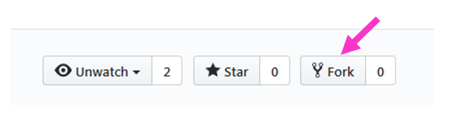
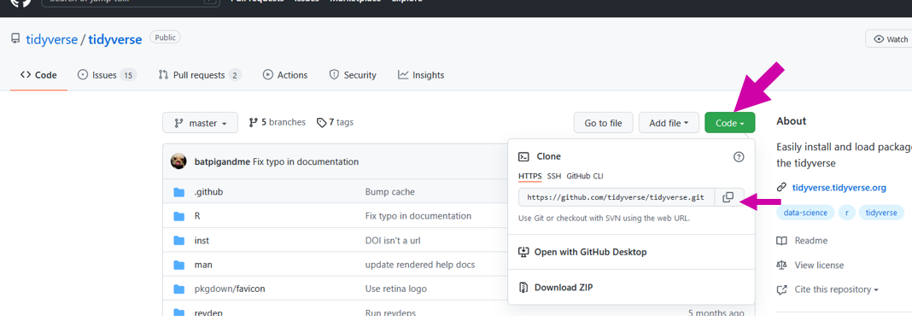
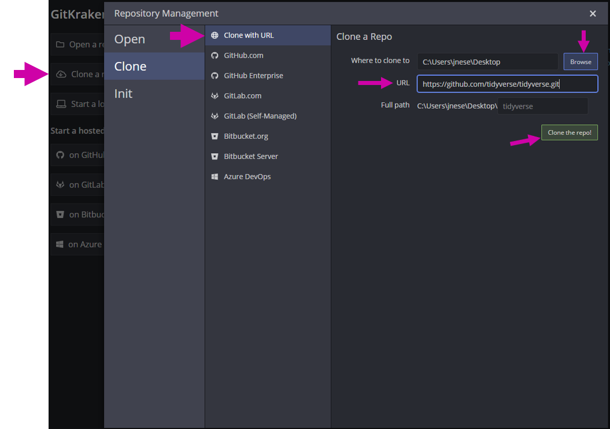
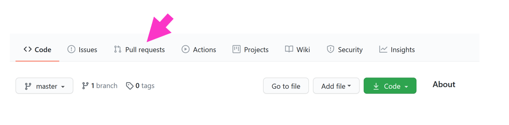
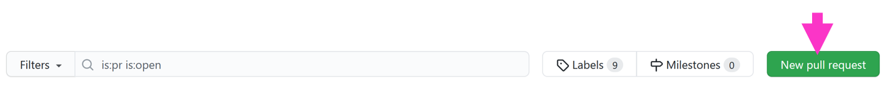
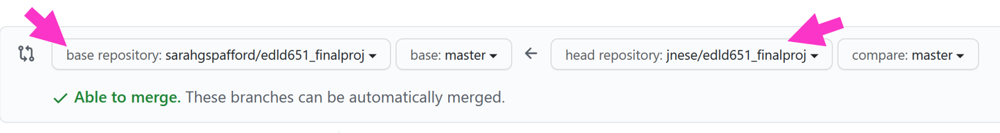
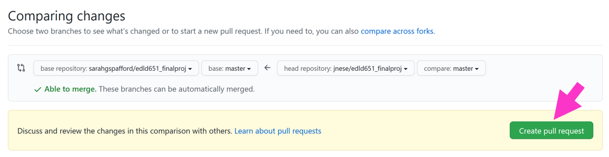
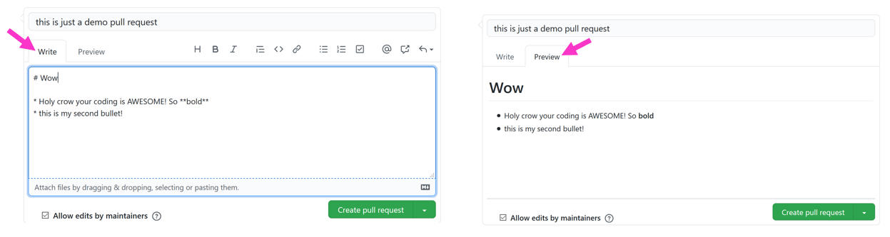
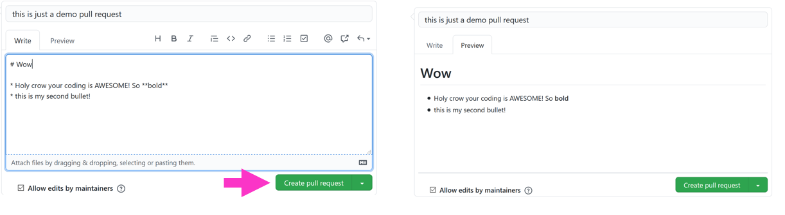

```{r setup, include=FALSE}
options(htmltools.dir.version = FALSE)
knitr::opts_chunk$set(
  fig.width=9, fig.height=3.5, fig.retina=3,
  out.width = "100%",
  cache = FALSE,
  echo = TRUE,
  message = FALSE, 
  warning = FALSE,
  error = TRUE
#  hiline = TRUE
)
library(xaringan)
library(xaringanExtra)
library(tidyverse)
library(knitr)
library(here)
library(janitor)
library(kableExtra)
library(palmerpenguins)
library(countdown)
library(DT)
library(reactable)
library(gtsummary)
```

```{r xaringan-themer, include=FALSE, warning=FALSE}
library(xaringanthemer)

style_duo_accent(
  primary_color = "#1F4E79",
  secondary_color = "#0072B2",
  header_font_google = google_font("Atkinson Hyperlegible", "600"),
  text_font_google   = google_font("Atkinson Hyperlegible", "300", "300i"),
  code_font_google   = google_font("IBM Plex Mono"),
  colors = c(
    darkblue = "#0072B2",
    lightblue = "#56B4E9",
    darkorange = "#D55E00",
    lightorange = "#E69f00",
    yellow = "#f0e442",
    green = "#009E73",
    pink = "#CC79A7",
    gray = "999999",
    white = "#FFFFFF",
    black = "#000000"
  )
  #inverse_header_color = "#FFFFFF"
)
```

```{r xaringanExtra-freezeframe, echo=FALSE}
xaringanExtra::use_freezeframe()
```

class: center, inverse

background-image: url("images/student-experience-surveys-slide.png")


---

class: inverse, left, middle

# Factors & Pull Requests 
## Week 9

---

# Agenda

* Citations
* Final Project Review
* Discuss factors and factor re-leveling
* Walk through a *.green[pull request (PR)]*
* Quick note on `ggplot()`: `group =` & `color/fill =` 


**Overall Purpose**

* Understand factors and how to manipulate them
* Understand how to complete a *.green[pull request (PR)]*

---
class: center

# Homework 8


---
class: inverse, left, middle

# Citation Styles
## (cheat sheet)

---
# Citation Styles

```{r echo=FALSE}
tibble::tribble(
  ~`Citation Style (using the tag)`,                                  ~Output,
                        "@Briggs11",                "Briggs and Weeks (2011)",
  "[see @Baldwin2014; @Caruso2000]", "(see Baldwin et al. 2014; Caruso 2000)",
                  "[@Linn02, p. 9]",             "(Linn and Haug 2002, p. 9)",
                  "[-@Goldhaber08]",                                  "(2008)"
  ) %>% 
  kable()

```

.footnote[
Reminder
]

---
## Also, cite `R`!

```{r echo=TRUE}
citation()
```

---
## And the packages you used!

```{r echo=TRUE}
citation("tidyverse")
```

---
class: inverse, left, middle

# Final Project

---
## Final Project - Data Prep Script

* Expected to be a work in progress

* Provided to your peers so they can learn from you as much as you can learn from their feedback

**Peer Review**

* Understand the purpose of the exercise

* Conducted as a professional product

* Should be **very** encouraging 

* Zero tolerance policy for inappropriate comments

---
# Final Project – Presentation

Groups are expected to present for about **25-30 minutes** (split evenly among members). Group order randomly assigned. 

Email me your presentation by midnight 11/29 so I can share through my machine.

---
# Final Project – Presentation

<b>Presentation cover the following:</b>
* Share your journey (everyone, at least for a minute or two)

* Discuss challenges you had along the way

* Celebrate your successes

* Discuss challenges you are still facing

* Discuss substantive findings

* Show off your cool figures!

* Discuss next `R` hurdle you want to address

---
# Final Project – Paper

* R Markdown document
  + Abstract, Intro, Methods, Results, Discussion, References
  + Should be brief: 3,500 words max 
  
* No code displayed - should look similar to a manuscript being submitted for publication

* Include at least 1 table

* Include at least 2 plots

* Should be fully open, reproducible, and housed on GitHub
  + I should be able to clone your repository, open the R Studio Project, and reproduce the full manuscript (by knitting the R Markdown doc)

---
# Final Project

The following functions: 
* `pivot_longer()`
* `mutate()`
* `select()`
* `filter()`
* `pivot_wider()`
* `group_by()`
* `summarize()`

---
# Scoring Rubric

Check the [syllabus](https://uo-datasci-specialization.github.io/c1-intro-fall-2022/syllabus.html) for Presentation and Final Paper scoring rubrics

---
class: inverse, left, middle

# Revisiting git

---
## Before we jump in...

#### ...let's revisit git

Talk with neighbor. What do these terms mean?
Talk about them in the order you would encounter them in your workflow 

* *.green[clone]*
* *.green[pull]*
* *.green[stage]*
* *.green[commit]*
* *.green[push]*
* *.green[repo]*
* *.green[remote]*

```{r, echo=FALSE}
countdown(minutes = 3, seconds = 0, bottom = 0, warn_when = 30)
```

---

class: inverse, left, middle

# Factors
## just the basics

---
# When do we really want factors?

Generally two reasons to declare a factor

1. Only finite number of categories
  + treatment/control
  + income categories
  + performance levels
  + etc.
  
2. Use in modeling

---
# Creating factos

Imagine you have a vector of months

```{r}
months_4 <- c("Dec", "Apr", "Jan", "Mar")
```

--

We could store this as a string, but there are issues with this:
* There are only 12 possible months
  + factors will help us weed out values that don't conform to our predefined levels, which helps safeguard against typos, etc.
  
* You can't sort this vector in a meaningful way
  + default is alphabetic sorting

--

```{r}
sort(months_4)
```

---
# Define it as a factor

```{r}
months_4 <- factor(months_4, levels = c("Jan", "Feb", "Mar", "Apr", "May", "Jun", "Jul", "Aug", "Sep", "Oct", "Nov", "Dec"))
months_4
```

--

Now we can sort

```{r}
sort(months_4)
```

---
# Accessing and modifying levels

Uset the `levels()` function

--

```{r}
levels(months_4)
```

---
# Provides an error check of sorts

```{r, warning=TRUE}
months_4[5] <- "Jam"
```

--

```{r}
months_4
```

---
# What if we don’t specify levels?

If you define a factor without specifying the levels, it will assign them alphabetically

```{r, results='hide'}
mnths <- factor(c("Dec", "Apr", "Jan", "Mar"))
```

--

```{r}
mnths
```

---
<p style="float: right;"></p>
# [`{forcats}`](https://forcats.tidyverse.org/)

* When working with factors, we can use the `{forcats}` package
  + `for cat`egorical variables
  + anagram of factors
  
--

* Part of the `{tidyverse}` so should be good to go

--

* All functions start with `fct_`
  + use the autofill in RStudio

---
# Change level order – `fct_inorder()`

#### In order they are entered
```{r}
(mnths <- factor(c("Dec", "Apr", "Jan", "Mar")))
```

--

```{r}
mnths %>% 
  factor(., levels = c("Jan", "Mar", "Apr", "Dec")) %>% 
  sort(.)
```

---
# Change level order – `fct_inorder()`

#### In order they are entered
```{r}
(mnths <- factor(c("Dec", "Apr", "Jan", "Mar")))
```

--

```{r}
mnths %>% 
  factor(., levels = c("Jan", "Mar", "Apr", "Dec")) %>% 
  fct_inorder() %>% #<<
  sort(.)
```

---
# Change level order – `fct_infreq()`

#### In order of frequency

```{r}
c("b", "b", "c", "a", "a", "a") %>% 
    fct_infreq() #<<
```

--

This can be **especially** useful for plotting

```{r eval=FALSE}
ggplot(aes(x, fct_infreq(y))
```


---
# Investigate factors

* `{tidyverse}` gives you convenient way to evaluate factors
  + `count()`
  + `geom_bar()` or `geom_col())` with `{ggplot2}`

* But don't forget about the base function `unique()`
  + e.g., `unique(df$factor_variable)`

---
# General Social Survey (GSS)

```{r}
forcats::gss_cat
```

---

```{r}
gss_cat %>% 
  count(partyid)
```

--

```{r}
levels(gss_cat$partyid)
```

---

```{r}
unique(gss_cat$partyid)
```

--

How many `unique` categories are there (if you have a lot)?

```{r}
length(unique(gss_cat$partyid))
```


---

```{r}
ggplot(gss_cat, aes(partyid)) +
    geom_bar()
```

---

ggplot(gss_cat, aes(.pink[fct_infreq(]partyid.pink[)])) +
<br>&nbsp;&nbsp;&nbsp;&nbsp;&nbsp;geom_bar()
    
```{r, echo=FALSE}
ggplot(gss_cat, aes(fct_infreq(partyid))) +
    geom_bar()
```

---
# Change level order – `fct_relevel()`

#### Change level order by hand 
  + *probably one I use most*

```{r eval=FALSE}
fct_relevel(variable_name, 
            "first_level", 
            "second_level", 
            "third_level", 
            ...)
```

---

```{r}
set.seed(3000)
tibble(
 month = c("Jan", "Feb", "Mar", "Apr", "May", "Jun", "Sep", "Oct", "Nov", "Dec"),
 suspensions = sample(c(5:75), size = 10)
)
```

---

```{r}
set.seed(3000) #<<
tibble(
 month = c("Jan", "Feb", "Mar", "Apr", "May", "Jun", "Sep", "Oct", "Nov", "Dec"),
 suspensions = sample(c(5:75), size = 10) #<<
)
```

---

```{r}
set.seed(3000)
tibble(
 month = c("Jan", "Feb", "Mar", "Apr", "May", "Jun", "Sep", "Oct", "Nov", "Dec"),
 suspensions = sample(c(5:75), size = 10)
) %>% 
  ggplot(aes(month, suspensions)) + #<<
  geom_col() #<<
```

---

```{r eval=FALSE}
set.seed(3000)
tibble(
 month = c("Jan", "Feb", "Mar", "Apr", "May", "Jun", "Sep", "Oct", "Nov", "Dec"),
 suspensions = sample(c(5:75), size = 10)
) %>% 
  mutate(month = fct_relevel(month, #<<
                    "Sep", "Oct", "Nov", "Dec", "Jan", "Feb", "Mar", "Apr", "May")) #<<
```

---
```{r}
set.seed(3000)
tibble(
 month = c("Jan", "Feb", "Mar", "Apr", "May", "Jun", "Sep", "Oct", "Nov", "Dec"),
 suspensions = sample(c(5:75), size = 10)
) %>% 
  mutate(month = fct_relevel(month,
                    "Sep", "Oct", "Nov", "Dec", "Jan", "Feb", "Mar", "Apr", "May")) %>% 
  ggplot(aes(month, suspensions)) + #<<
  geom_col() #<<
```

---
# Change level order – `fct_reorder()`

#### Reorder according to another variable

```{r}
(relig_summary <- gss_cat %>%
  group_by(relig) %>%
  summarise(tvhours = mean(tvhours, na.rm = TRUE),
            n = n()))
```

---

```{r}
ggplot(relig_summary, aes(tvhours, relig)) + 
  geom_point()
```

---
ggplot(relig_summary, aes(tvhours, .pink[fct_reorder(]relig, .pink[tvhours)])) + 
<br>&nbsp;&nbsp;&nbsp;&nbsp;&nbsp; geom_point()

```{r, echo=FALSE}
ggplot(relig_summary, aes(tvhours, fct_reorder(relig, tvhours))) + 
  geom_point()
```

---
# Or `mutate()` the factor reorder

```{r}
relig_summary %>% 
  mutate(relig = fct_reorder(relig, tvhours)) %>% #<<
  ggplot(aes(tvhours, relig)) + 
  geom_point()
```

---
# Quick aside for error bars

```{r}
(relig_summary_eb <- gss_cat %>%
  group_by(relig) %>%
  summarise(tvhours_mean = mean(tvhours, na.rm = TRUE),
            tvhours_se   = sqrt(var(tvhours, na.rm = TRUE) / 
                                  length(na.omit(tvhours))),
            n = n()))
```

---
# Quick aside for error bars

```{r}
(relig_summary_eb <- gss_cat %>%
  group_by(relig) %>%
  summarise(tvhours_mean = mean(tvhours, na.rm = TRUE), #<<
            tvhours_se   = sqrt(var(tvhours, na.rm = TRUE) / 
                                  length(na.omit(tvhours))),
            n = n()))
```

---
# Quick aside for error bars

```{r}
(relig_summary_eb <- gss_cat %>%
  group_by(relig) %>%
  summarise(tvhours_mean = mean(tvhours, na.rm = TRUE),
            tvhours_se   = sqrt(var(tvhours, na.rm = TRUE) / #<<
                                  length(na.omit(tvhours))), #<<
            n = n()))
```

---
# Quick aside for error bars

```{r}
(relig_summary_eb <- gss_cat %>%
  group_by(relig) %>%
  summarise(tvhours_mean = mean(tvhours, na.rm = TRUE),
            tvhours_se   = sqrt(var(tvhours, na.rm = TRUE) / 
                                  length(na.omit(tvhours))),
            n = n())) #<<
```

---
# Quick aside for error bars

```{r fig.height=3}
ggplot(relig_summary_eb, #<<
       aes(tvhours_mean, fct_reorder(relig, tvhours_mean))) + 
  geom_errorbarh(aes(xmin = tvhours_mean - 1.96 * tvhours_se,
                     xmax = tvhours_mean + 1.96 * tvhours_se),
                 color = "cornflowerblue") +
  geom_point()
```

---
# Quick aside for error bars

```{r fig.height=3}
ggplot(relig_summary_eb, 
       aes(tvhours_mean, fct_reorder(relig, tvhours_mean))) + #<<
  geom_errorbarh(aes(xmin = tvhours_mean - 1.96 * tvhours_se,
                     xmax = tvhours_mean + 1.96 * tvhours_se),
                 color = "cornflowerblue") +
  geom_point()
```

---
# Quick aside for error bars

```{r fig.height=3}
ggplot(relig_summary_eb, 
       aes(tvhours_mean, fct_reorder(relig, tvhours_mean))) + 
  geom_errorbarh(aes(xmin = tvhours_mean - 1.96 * tvhours_se, #<<
                     xmax = tvhours_mean + 1.96 * tvhours_se), #<<
                 color = "cornflowerblue") + #<<
  geom_point()
```

---
# Quick aside for error bars

```{r fig.height=3}
ggplot(relig_summary_eb, 
       aes(tvhours_mean, fct_reorder(relig, tvhours_mean))) + 
  geom_errorbarh(aes(xmin = tvhours_mean - 1.96 * tvhours_se,
                     xmax = tvhours_mean + 1.96 * tvhours_se),
                 color = "cornflowerblue") +
  geom_point() #<<
```

---
# Modifying factor levels – `fct_recode()`

#### Make modifying factors more explicit

`fct_recode(var_name, "new level" = "old level"...`

```{r, eval=FALSE}
gss_cat %>%
  mutate(partyid = fct_recode(partyid,
    "Republican, strong" = "Strong republican", #<<
    "Republican, weak" = "Not str republican", #<<
    "Independent, near rep" = "Ind, near rep", #<<
    "Independent, near dem" = "Ind, near dem", #<<
    "Democrat, weak" = "Not str democrat", #<<
    "Democrat, strong" = "Strong democrat")) %>% #<<
  count(partyid)
```

---
```{r}
gss_cat %>%
  mutate(partyid = fct_recode(partyid,
    "Republican, strong" = "Strong republican", #<<
    "Republican, weak" = "Not str republican", #<<
    "Independent, near rep" = "Ind, near rep", #<<
    "Independent, near dem" = "Ind, near dem", #<<
    "Democrat, weak" = "Not str democrat", #<<
    "Democrat, strong" = "Strong democrat")) %>% #<<
  count(partyid)
```

---
# Collapsing levels – `fct_recode()`

`fct_recode()` can also be used to collapse levels easily

```{r, eval=FALSE}
gss_cat %>%
  mutate(partyid = fct_recode(partyid,
    "Republican, strong"    = "Strong republican",
    "Republican, weak"      = "Not str republican",
    "Independent, near rep" = "Ind,near rep",
    "Independent, near dem" = "Ind,near dem",
    "Democrat, weak"        = "Not str democrat",
    "Democrat, strong"      = "Strong democrat",
    "Other"                 = "No answer", #<<
    "Other"                 = "Don't know", #<<
    "Other"                 = "Other party")) %>% #<<
  count(partyid)
```

---
```{r}
gss_cat %>%
  mutate(partyid = fct_recode(partyid,
    "Republican, strong"    = "Strong republican",
    "Republican, weak"      = "Not str republican",
    "Independent, near rep" = "Ind,near rep",
    "Independent, near dem" = "Ind,near dem",
    "Democrat, weak"        = "Not str democrat",
    "Democrat, strong"      = "Strong democrat",
    "Other"                 = "No answer", #<<
    "Other"                 = "Don't know", #<<
    "Other"                 = "Other party")) %>% #<<
  count(partyid)
```

---
# Collapsing levels – `fct_collapse()`

`fct_collapse()` is one of the more useful functions in `{forcats}`

* Collapse all categories into Republican, Democrat, Independent, or Other

```{r}
gss_cat %>%
  mutate(partyid = fct_collapse(partyid, #<<
    	Other = c("No answer", "Don't know", "Other party"),
    	Rep = c("Strong republican", "Not str republican"),
    	Ind = c("Ind,near rep", "Independent", "Ind,near dem"),
    	Dem = c("Not str democrat", "Strong democrat")
  )) %>%
  count(partyid)
```

---
# Collapsing levels – `fct_lump_?()`

#### `fct_lump_?()` – "lump" a bunch of categories together

* `fct_lump_n(factor_variable, n)`:

--
lumps all levels except for the `n` most frequent (or least frequent if `n` < 0) into "Other" level

--

* `fct_lump_min(factor_variable, min)`:

--
lumps levels that appear fewer than `min` times

--

* `fct_lump_prop(factor_variable, prop)`:

--
lumps levels that appear in fewer `prop` $\times$ `n` times

---
# Collapsing levels – `fct_lump_n()`

Collapse to `n` = **9** religious groups: top 8 groups plus "Other"

```{r}
gss_cat %>% 
  mutate(rel = fct_lump_n(relig, 9)) %>% #<<
  count(rel)
```

---
# Collapsing levels – `fct_lump_min()`

Collapse to all religious groups that appear less than `min` = 200 into "Other"

```{r}
gss_cat %>% 
  mutate(rel = fct_lump_min(relig, min = 200)) %>% #<<
  count(rel) 
```

---
# Collapsing levels – `fct_lump_prop()`

Collapse to all religious groups that appear less than `prop` = 10% into "Other"

```{r}
gss_cat %>% 
  mutate(rel = fct_lump_prop(relig, prop = .10)) %>% #<<
  count(rel) 
```

---
# Missing levels

```{r}
levels(gss_cat$race)
```

--

```{r}
gss_cat %>% 
  count(race)
```

--

```{r}
table(gss_cat$race)
```

---
# Missing levels

```{r}
ggplot(gss_cat, aes(race)) +
    geom_bar()
```

---
# Missing levels

```{r}
ggplot(gss_cat, aes(race)) +
    geom_bar() +
    scale_x_discrete(drop = FALSE) #<<
```

---
# Review

`fct_inorder()`:

--
Levels ordered as entered

--

`fct_infreq()`:

--
Change level order in order of frequency (largest first)

--

`fct_relevel()`:

--
Change level order by hand

--

`fct_reorder()`:

--
Change level order according to another variable

--

`fct_recode()`:

--
Recode (collapse) levels into new named levels

--

`fct_collapse()`:

--
Recode many levels into fewer levels

--

`fct_lump_?()`:

--
Recode all levels into "Other":
* except for the `n` most frequent - `fct_lump_n()`
* that appear fewer than `min` times - `fct_lump_min()`
* that appear less than `prop`% - `fct_lump_prop()`

---
class: inverse, left, middle

# Pull Requests 

---
# Peer Review of Data Prep Script

#### Expectations

Feedback:
1. Note <u>at least three</u> areas of strength

2. Note <u>at least one</u> thing you learned from reviewing their script

3. Note <u>at least one and no more than three</u> areas for improvement

--

Making your code publicly available can feel daunting 
* The purpose of this portion of the final project is to help us all learn from each other
* We are all learning
  + Be constructive in your feedback
  + Be kind
* Under no circumstances will negative comments be tolerated 
  + Any comments that could be perceived as negative, and outside the scope of the code, will result in an immediate score of zero
  
---
# Peer Review GitHub Process

1. Locate GitHub .green[repo] of assigned peer to review

2. Fork the .green[repo]

3. Clone the .green[repo]

4. Provide script feedback
  + edit the .Rmd file directly
  + edit code
  + provide comments in code and/or text (`Ctrl/Command + Shift + C`)
  + *.green[commit]* & *.green[push]*

5. Create .green[Pull Request (PR)]
* Write brief summary of the PR that includes
  + \>= 3 strengths
  + \>= 1 thing you learned
  + 1 to 3 three areas of improvement

---
### 1. Locate GitHub repo of assigned peer to review

```{r echo=FALSE}
roster <- readxl::read_xlsx(here::here("nopublish", "groups.xlsx")) %>% 
  mutate(Student = paste(first, last))

random_draw <- function(x){
  repeat{
    groups <- as.character(x$group)
    x$samp <- sample(groups, replace = FALSE)
    x$check <- (x$group == x$samp)
    if (sum(x$check) == 0) break
  }
  return(x)
}

set.seed(651)
peer_review <- random_draw(roster)

peer_review %>% 
  select(Student, group = samp) %>% 
  left_join(
    roster %>% 
      select(group, git_page, file) %>% 
      distinct()
  ) %>% 
  select(Student, `Repo to Review` = git_page, `File to Review` = file) %>% 
  kable() %>% 
  kable_styling(font_size = 10)
```


---
# 2. Fork the repo

1. Navigate to the (host) GitHub repo
2. Click Fork in the upper right corner
3. Where to fork? – **your GitHub account**

```{r, echo=FALSE}


```

---
# 3. Clone the repo

.pull-left[
(1) Clone the repo
* copy the URL

```{r, echo=FALSE, out.width='75%'}

```
]
--

.pull-right[
(2) Open GitKraken
* *Clone with URL*
* Where will it live on your local machine?
  + it's own folder, with no other RProjects
  
```{r, echo=FALSE, out.width='75%'}

```
]

---
# 4. Provide script feedback

* Open `RProj` in your *.green[local]* (i.e., on your machine)
* Find the .Rmd document you will be reviewing
  + it should be an Rmd document
* Make your edits/comments
  + edit code as you like
  + include a comment for each edit!
  + Provide comments in code **and/or** text (`Ctrl/Command + Shift + C`)
* Commit as you go (if you are working on this across sessions/days)
* **.green[Push] only when you are finished**

---
# 5. Create Pull Request (PR)

(1) Navigate back to the (host) GitHub repo

--

(2) Click “Pull requests”

```{r, echo=FALSE, out.width='50%'}

```

--

(3) Click “New pull request”

```{r, echo=FALSE, out.width='50%'}

```

---
# 5. Create Pull Request (PR)

(4) Click *"Compare across forks"*

```{r, echo=FALSE}

```

--

Use drop-downs so that:
* *host* repo is on **left**
* *your* repo is on the **right**

```{r, echo=FALSE}

```

--

You will be able view the changes you made to the .Rmd document

---
# 5. Create Pull Request (PR)

(5) Click *"Create pull request"*

```{r, echo=FALSE}

```

---
# 5. Create Pull Request (PR)

Write a brief summary list of the PR that includes
  + \>= 3 strengths
  + \>= 1 thing you learned
  + 1 to 3 three areas of improvement
  + **Use markdown formatting, headers or list!**

```{r, echo=FALSE}

```

---
# 5. Create Pull Request (PR)

(6) Click *"Create pull request"* when you're done

```{r, echo=FALSE}

```


---
# 5. Create Pull Request (PR)
## Recap

(1) Navigate back to the (host) GitHub repo

(2) Click *"Pull requests"*

(3) Click *"New pull request"*

(4) Click *"Compare across forks"*
* Use drop-downs so that:
  + Host .green[repo] is on the left, your .green[repo] is on the right
* View changes
(5) Click *"Create pull request"*
* Write brief summary list of the .green[PR] that includes
  + \>= 3 strengths
  + \>= 1 thing you learned
  + 1 to 3 three areas of improvement
  + **Use markdown formatting, headers, or list!**
(6) Click *"Create pull request"*

---
# Reviewing your PRs

You will get an email from GitHub

1. Click on first link, for .green[PR]

2. Click *"Commits"* tab

3. Click on *"File changes"* to see changes

4. Copy/paste all desired changes

5. Don’t close *"Close PR"* just yet; I want to review

---
class: inverse, left, middle

# Next time

---
# Before next class

* Final Project
  + .red[Final Project: Peer Review of Script]
  + .red[Final Project: Presentations] - email me your content before class
* Homework
  + **Homework 10**

---
class: inverse, left, middle

---

```{r, echo=FALSE, eval=FALSE}
renderthis::to_pdf(here::here("slides", "w9_factors.html"), complex_slides = TRUE)
```


